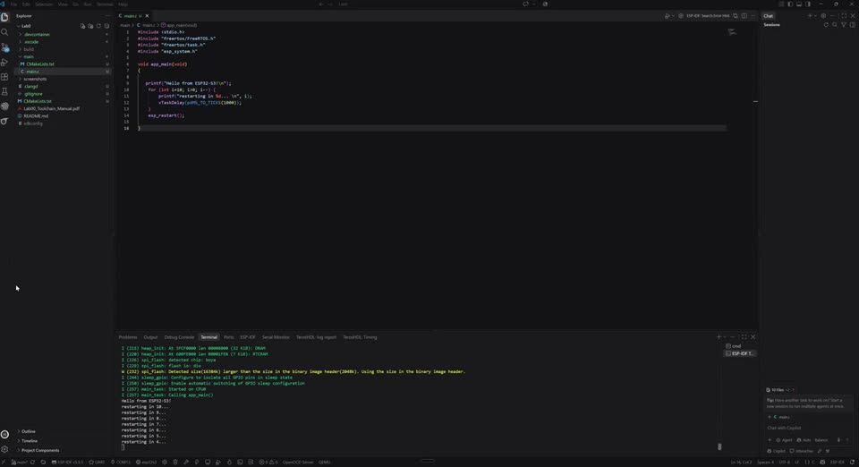

# Lab 0: Toolchain and First Flash

Setting up ESP-IDF from scratch and proving the whole build, flash and monitor loop works before a single wire is connected.

[](screenshots/lab00_demo_hello_restart_countdown.mp4)

*Click to play. The board prints its chip info, counts down from 10 and restarts, over and over.*

| | |
|---|---|
| **Board** | ESP32-S3 N16R8 (Lonely Binary), 16 MB flash, 8 MB octal PSRAM |
| **Framework** | ESP-IDF v5.5.5, `xtensa-esp32s3-elf` GCC, CMake, Ninja |
| **Hardware** | Board only |
| **Key APIs** | `app_main()`, `esp_chip_info()`, `esp_flash_get_size()`, `vTaskDelay()`, `esp_restart()` |

## What it does

`app_main()` asks the chip about itself (core count, silicon revision, flash size), prints it, counts down and calls `esp_restart()`. The program is tiny on purpose. The real deliverable is a build, flash and monitor loop I trust, so that later failures can be blamed on code and not on the setup.

## How it works

- **`app_main()` is not `main()`.** By the time it runs, the second stage bootloader has set up clocks, flash, PSRAM and the FreeRTOS scheduler. `app_main()` is just the first task.
- **A project is a CMake project.** The top `CMakeLists.txt` pulls in the IDF build system, `main/` is a component, and `sdkconfig` holds thousands of build options generated from `sdkconfig.defaults`.
- **Flashing is three writes, not one.** The bootloader, the partition table and the app each go to their own flash offset. Knowing this makes the OTA and partition work in Lab 15 much less magic.

## Coming from the TM4C123

In ECE 425 the flow was Keil, a vendor project file and an ICDI probe, and `main()` really was the first thing to run. Here everything is command line and plain text (CMake, Ninja, GCC, esptool), and a lot more happens before my code starts. The upside is that the whole configuration is diffable and reproducible.

## Results

| Check | Result |
|---|---|
| Toolchain installed | `idf.py --version` reports v5.5.5 |
| Right target | Build names `esp32s3`, chip info reports 2 cores |
| Flash works | esptool verifies the hash on all three images |
| App runs | Boot log, chip report, countdown and clean restart, in a loop |

## What broke

- **The installer crashed halfway.** The ESP-IDF Installation Manager puts its tools on `C:\Espressif\` no matter where the SDK goes, and that drive was nearly full. Setting all three paths (SDK, downloads, tools) by hand fixed it.
- **No COM port showed up.** Two causes worth knowing: the board has two USB-C ports that behave differently (native USB-Serial-JTAG and a UART bridge), and a charge-only cable looks exactly like a driver problem. Holding BOOT and tapping RESET forces download mode when all else fails.
- **A copied project built for the wrong chip.** `IDF_TARGET` lives in `sdkconfig`, which comes along when you copy a folder. `idf.py set-target esp32s3` fixes it, and it only reconfigures, so build before asking for the `.elf`.
- **The VS Code extension kept losing its settings** and once flashed a stale build. I moved to `idf.py -p COMx build flash monitor` from the terminal and kept the extension for browsing.
- **Flash size reported as 2 MB on a 16 MB part.** Harmless here, a real blocker in Lab 15. Fixed in `sdkconfig.defaults` from the start.

## Build

```powershell
idf.py set-target esp32s3
idf.py build
idf.py -p COMx flash monitor
```
