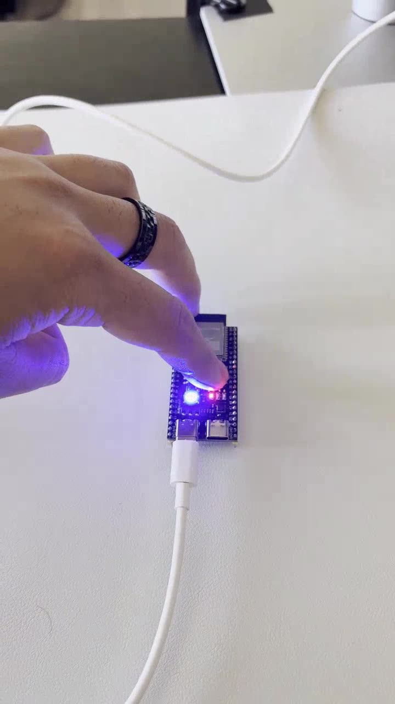
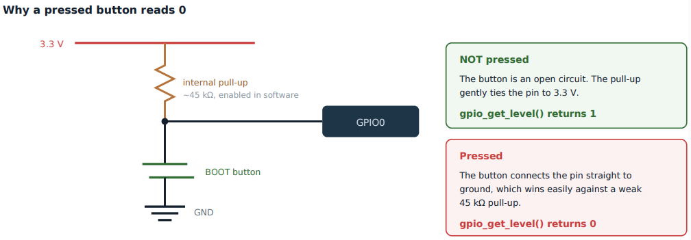

# Lab 1: GPIO, the RGB LED and the BOOT Button

Digital input and output on the ESP32-S3. Reading an active-low button with a simple debounce, and driving an addressable WS2812 LED whose timing is generated in hardware by the RMT peripheral.

[](screenshots/lab01_demo_boot_button_cycles_rgb_led.mp4)

*Click to play. Each press of the BOOT button moves the onboard RGB LED to the next step: red, green, blue, off.*



| | |
|---|---|
| **Board** | ESP32-S3 N16R8 |
| **Peripherals** | GPIO, RMT |
| **Pins** | GPIO48 onboard WS2812 RGB LED, GPIO0 BOOT button |
| **Parts** | None, both are on the board |
| **Key APIs** | `gpio_config()`, `gpio_get_level()`, `led_strip_new_rmt_device()`, `led_strip_set_pixel()`, `led_strip_clear()`, `led_strip_refresh()` |

## How it works

- **The button is active low.** An internal pull-up holds GPIO0 at 3.3 V and pressing the button shorts it to ground, so a press reads 0. GPIO0 is also a strapping pin that picks the boot mode at reset, so it is safe to read after boot but not to drive.
- **Debounce by waiting for release.** Contacts bounce for a few milliseconds. The loop polls every 20 ms, counts a press when it sees a 0, then waits in 10 ms steps until the button reads 1 again before it looks for the next press. Lab 8 replaces this with a real interrupt and a queue.
- **`1ULL << pin`, not `1 << pin`.** GPIO48 is past bit 31, so a 32-bit shift is undefined and quietly configures the wrong pin.
- **The LED is a serial device, not three LEDs.** The WS2812 encodes each bit as a pulse width, with 1 and 0 a few hundred nanoseconds apart. A FreeRTOS task cannot toggle a pin that precisely, so the RMT peripheral (10 MHz tick, through the `led_strip` component) clocks the waveform out in hardware.
- **Set, then refresh.** `led_strip_set_pixel()` only writes RAM. `led_strip_refresh()` sends it. Describe the state, then commit it. The same pattern comes back with the display in Lab 22.

## Results

| Check | Result |
|---|---|
| LED output | Lights on the first refresh |
| Button input | Reads 1 at idle and 0 while held |
| Debounce | One event per physical press, not three to five |
| RMT timing | Color matches the RGB value written, no flicker |
| Extension | Each press steps red, green, blue, off, which forced a clean split between the color the firmware thinks it set and what the LED is showing |

## What broke

- **`led_strip.h` not found on a project that built before.** `fullclean` wipes `managed_components/` but leaves `dependencies.lock`. Deleting both and running `idf.py reconfigure` brought it back.
- **Editor errors that were not errors.** clangd flagged ESP-IDF headers while GCC compiled fine, and once a real compile error scrolled past under the editor noise. Rule I kept from here on: the terminal is the truth. A user level clangd config pointing at `build/compile_commands.json` removed most of the noise for every lab.
- **A toggle that never toggled.** I wrote `on != on` instead of `on = !on`. Both compile. Only the hardware disagreed.
- **Autocomplete picked a wrong constant.** It filled in an unrelated MCPWM macro for `led_strip_clear()`, and since it is just an integer, it compiled. I turned inline AI completion off for the rest of the series after that and read the function signatures myself.

## Build

```powershell
idf.py set-target esp32s3
idf.py build flash monitor
```
