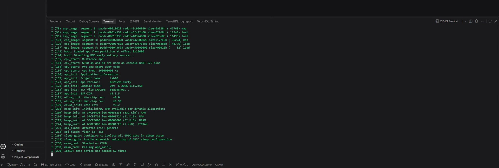
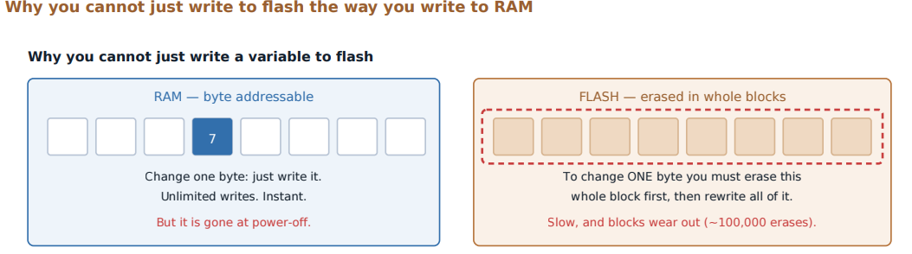

# Lab 10: Non-Volatile Storage

Keeping state across resets and power loss. A log-structured key/value store on flash, namespaces, wear levelling, and the partition table that carves the flash up in the first place.

[](screenshots/lab10_demo_boot_counter_survives_reset.mp4)

*Click to play. Each reset prints a boot count one higher than the last, read from and written back to flash.*



| | |
|---|---|
| **Board** | ESP32-S3 N16R8, 16 MB flash |
| **Subsystem** | NVS over the `nvs` data partition |
| **Demo** | A boot counter that survives reset and power loss |
| **Key APIs** | `nvs_flash_init()`, `nvs_open()`, `nvs_get_u32()`, `nvs_set_u32()`, `nvs_commit()`, `nvs_close()` |

## How it works

- **Flash is not RAM.** It erases in 4 KB sectors, a bit can only be programmed from 1 to 0, and each sector survives roughly 100,000 erases. Changing one byte in place means erasing and rewriting a whole sector.
- **NVS is log-structured.** Writing a key appends a new entry and marks the old one stale. When a page fills, live entries are copied to a fresh page and the old one is erased. That spreads wear by design. Great for settings, wrong for anything written at a high rate.
- **Namespaces.** `nvs_open("storage", ...)` scopes keys so two components can both use `count`. A namespace only exists after its first write.
- **The init idiom.** `nvs_flash_init()` can return `NO_FREE_PAGES` or `NEW_VERSION_FOUND`. Both are fixed by erasing and initializing again, and both are silent failures if you only check for `ESP_OK`.
- **`nvs_commit()`.** Writes are buffered until committed. Same class of bug as forgetting `ledc_update_duty()` in Lab 6.

## Coming from the TM4C123

The TM4C had a small internal EEPROM with a word-addressed API that handled erase-before-write inside the peripheral. No keys, no namespaces, no partition table. NVS adds all of that on top of raw flash, and the idea that carries over is that non-volatile memory has erase granularity and limited life.

## Results

| Check | Result |
|---|---|
| Survives reset | Counter goes up by one on every reset |
| Survives power loss | Continues after unplugging and plugging back in |
| Erase works | `idf.py erase-flash` sets it back to zero |
| Partition present | `idf.py partition-table` shows `nvs` at the expected offset |

## What broke

- **`ESP_ERR_NVS_NOT_FOUND` on a fresh board.** I opened the namespace read-only to read the counter first, but a namespace does not exist until something writes to it. On a brand new device that is the normal first-boot case, not an error, so the code now treats "not found" as zero. The same pattern matters again in Lab 15.
- **A value that said it saved and did not.** `nvs_set_u32` returned `ESP_OK`, but I never called `nvs_commit()`. A return code says the call was accepted, not that the effect happened.

## Build

```powershell
idf.py build flash monitor
```
