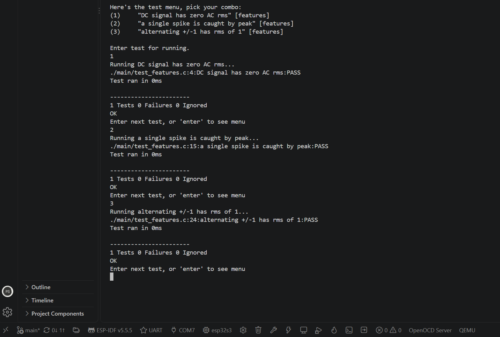
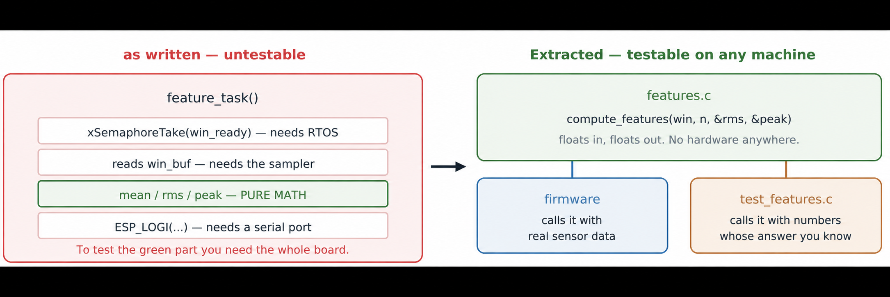

# Lab 11: On-Target Unit Testing with Unity

A real test suite running on the microcontroller. The Lab 7 feature math pulled out into a pure function, a Unity runner in flash, and an interactive test menu over serial. The move from "it looked right" to a repeatable pass.



*All three known-answer tests pass on the ESP32-S3: a DC signal has zero AC RMS, a single spike is caught by peak, and an alternating plus or minus 1 signal has RMS of exactly 1.*



| | |
|---|---|
| **Board** | ESP32-S3 N16R8 |
| **Framework** | Unity, bundled with ESP-IDF |
| **Console** | UART bridge port (the native USB port cannot take menu input here) |
| **Key APIs** | `TEST_CASE()`, `TEST_ASSERT_FLOAT_WITHIN()`, `unity_run_menu()` |

## How it works

- **The tests run on the chip, not my laptop.** Same int widths, same compiler, same optimizer and same float behavior as the shipped firmware.
- **Make the logic testable first.** Lab 7's `feature_task` blocked on a semaphore, read a shared buffer, did the math and logged. Only the math is logic. Pulling it into `compute_features(win, n, &rms, &peak)` means firmware and tests call the exact same function, so the tests exercise the code that ships.
- **Known-answer tests.** Inputs whose correct output you can work out on paper: a constant has no AC component, `+1, -1, +1, -1` has RMS 1, one big sample is the peak. If a test is derived from the code, it passes even when both are wrong.
- **Float tolerance.** Exact float equality is almost always the wrong assertion, so `TEST_ASSERT_FLOAT_WITHIN` is used throughout.
- **Edge cases.** A window of length 0 divides by zero, and that is the one the original code actually gets wrong.

## Results

| Check | Result |
|---|---|
| Menu appears | Lists the three registered tests and takes a selection |
| Tests pass | `1 Tests 0 Failures 0 Ignored`, OK, for each |
| Tests can fail | A deliberately broken scale factor was caught with a clear message |
| Repeatable | Same result across resets, no order dependence |

## What broke

- **The test menu came up empty.** `TEST_CASE` registers tests through a linker section, but nothing references those symbols, so the linker threw the whole object file away. No error, no warning. `WHOLE_ARCHIVE` on the test component forces it in. A real encounter with linker garbage collection.
- **Pressing Enter did nothing.** I was on the native USB port, where the console only mirrors output. Unity reads from UART0, which is the other USB-C port.
- **Task watchdog spam while the menu waited.** The menu polls the console and starves the idle task on core 0. Harmless, but noisy enough that I turned the task watchdog off for this lab.

## Build

```powershell
idf.py build flash monitor
```

Use the UART USB-C port, press Enter for the list, then `*` to run everything.
