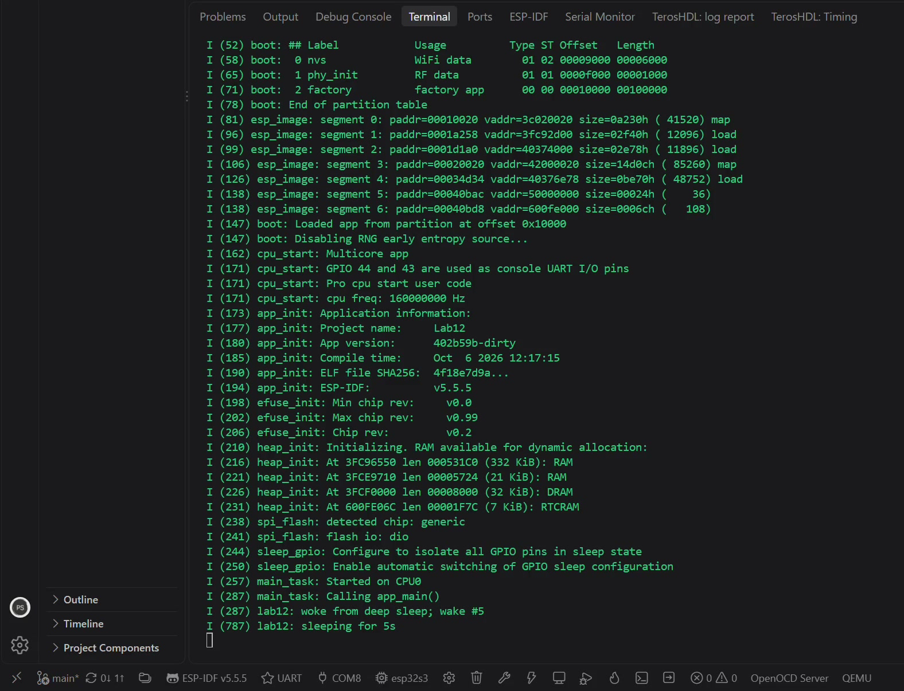
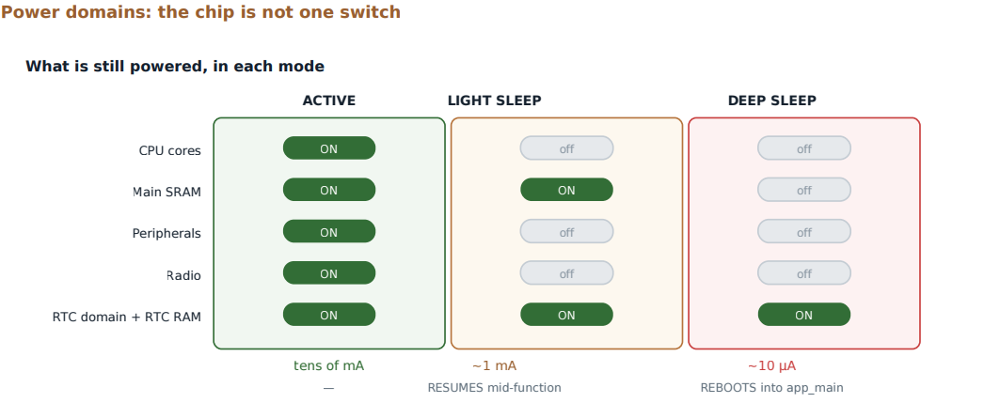
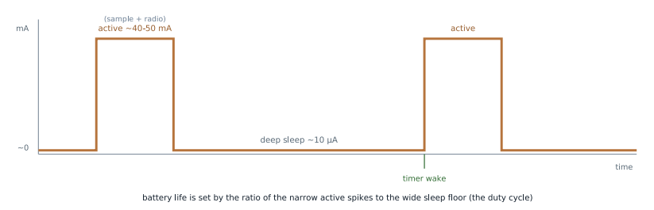

# Lab 12: Deep Sleep and Power Budgeting

Putting the chip into deep sleep, waking it on a timer, and keeping a counter alive across the sleep boundary in RTC memory. The core of any battery-powered sensor node.

[](screenshots/lab12_demo_deep_sleep_wake_counter.mp4)

*Click to play. The board wakes, logs `woke from deep sleep; wake #5`, sleeps for 5 s, and comes back as wake #6. The count lives in RTC memory.*

| Power domains | Current over time |
|---|---|
|  |  |

| | |
|---|---|
| **Board** | ESP32-S3 N16R8 |
| **Subsystem** | RTC controller, deep sleep, RTC slow memory |
| **Key APIs** | `esp_sleep_enable_timer_wakeup()`, `esp_deep_sleep_start()`, `esp_sleep_get_wakeup_cause()`, `RTC_DATA_ATTR` |

## How it works

- **Deep sleep is a reboot with a little memory.** The CPUs, most SRAM and the peripherals power down. Only the RTC domain stays on. On wake the chip runs the bootloader again and enters `app_main()` from the top.
- **`RTC_DATA_ATTR`.** Normal globals are gone after sleep. A variable marked `RTC_DATA_ATTR` lives in RTC memory that stays powered, which is how `wake_count` keeps climbing.
- **Cold boot or wake.** `esp_sleep_get_wakeup_cause()` tells them apart. That one branch at the top of `app_main()` is the whole shape of a duty-cycled device: full init on cold boot, minimum work on wake, then back to sleep.
- **Wake sources.** A timer here. A GPIO wake needs an RTC-capable pin, because the normal GPIO matrix is powered down.
- **Battery life is a duty cycle.** Short active spikes over a long low floor. Average current from the ratio, then divide the battery capacity by it.

## Results

| Check | Result |
|---|---|
| Enters deep sleep | Log stops and the chip goes quiet |
| Timer wake | Reboots every 5 s on schedule |
| State survives | `wake #5`, `wake #6`, ... instead of starting over |
| Cause is known | Cold boot and timer wake take different branches |

## What broke

- **The monitor died every sleep cycle.** The native USB port is part of the powered-down domain, so the COM port vanishes from Windows on every sleep and comes back too late to catch the `woke from deep sleep` line. The UART bridge port is a separate chip that stays connected, so the whole cycle is visible there.
- **A wake pin that could not wake anything.** GPIO wake only works on RTC-capable pins. Five minutes if you know the rule, an hour if you think the API is broken.

## Build

```powershell
idf.py build flash monitor
```

Monitor over the UART USB-C port.
