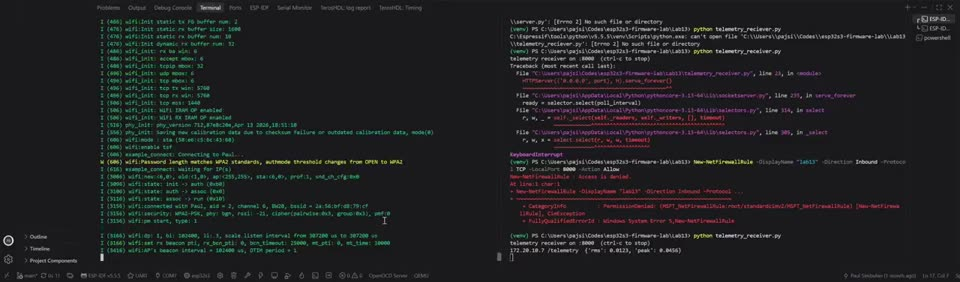
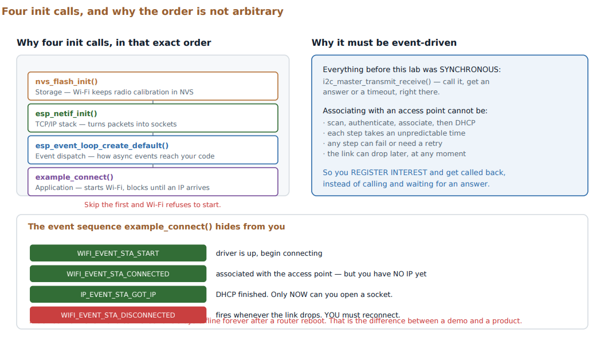

# Lab 13: Wi-Fi Station and JSON Telemetry

Getting data off the device. Event-driven Wi-Fi bring-up, then an HTTP client posting a JSON reading to a small Python receiver on my laptop.

[](screenshots/lab13_demo_wifi_http_post_to_laptop.mp4)

*Click to play. Left: the board joins the hotspot, gets an IP, and posts. Right: the laptop receiver prints the JSON body `{"rms":0.0123,"peak":0.0456}`.*



| | |
|---|---|
| **Board** | ESP32-S3 N16R8 |
| **Subsystems** | Wi-Fi station, LwIP, `esp_http_client`, `protocol_examples_common` |
| **Key APIs** | `nvs_flash_init()`, `esp_netif_init()`, `esp_event_loop_create_default()`, `example_connect()`, `esp_http_client_perform()` |
| **Host** | `telemetry_receiver.py`, a Python receiver on port 8000 that accepts POST |

## How it works

- **Four init calls, in order.** NVS (Wi-Fi keeps calibration there, which is why Lab 10 came first), the TCP/IP stack, the default event loop, then connect. Skip the first and Wi-Fi will not start.
- **Wi-Fi is event-driven.** There is no "connect and wait" call underneath. `example_connect()` from `protocol_examples_common` registers the event handlers for me and blocks until the station has an IP, so `main.c` never touches the events directly.
- **Associated is not the same as having an IP.** `WIFI_EVENT_STA_CONNECTED` means the radio joined the access point. DHCP is not done yet and any socket opened then fails. The event to wait for is `IP_EVENT_STA_GOT_IP`, which is what `example_connect()` waits on.
- **Disconnects happen.** `WIFI_EVENT_STA_DISCONNECTED` fires whenever the link drops, and the device has to reconnect on its own. The example component's handler retries the connection on that event. That is the difference between a demo and a product.
- **The POST.** Build the JSON body with `snprintf`, post it to `http://<laptop-ip>:8000/telemetry`, set `Content-Type: application/json`, perform, read the status code, and always clean up the client so nothing leaks per transmission.

## Results

| Check | Result |
|---|---|
| Joins the network | Associates with the hotspot and logs the BSSID |
| Gets an IP | `got ip: 172.20.10.7` |
| POST succeeds | Board logs `POST -> HTTP 200` |
| Payload correct | Laptop prints the JSON with both keys |

## What broke

- **`POST -> HTTP 501` and nothing on the laptop.** The receiver was `python -m http.server`, which only implements GET and HEAD. The firmware was right, my host setup was not. A small receiver with a `do_POST` handler fixed it. When the error comes back from the part you did not write, check that part first.
- **`select() timeout` on the POST.** The code posted to `172.20.10.3` but the laptop had `172.20.10.5` on that hotspot. Hotspot addresses change, so `ipconfig` first.
- **A crash at boot: `Connecting to myssid`.** Every lab has its own `sdkconfig`, so the Wi-Fi settings from one lab do not carry over. Credentials go in menuconfig only, never in the repo.

## Build

```powershell
idf.py menuconfig   # Example Connection Configuration: SSID and password
idf.py build flash monitor
```

Start the receiver on the laptop first with `python telemetry_receiver.py` (port 8000 by default). Same network for both, and set the laptop's IP in `main.c`.
