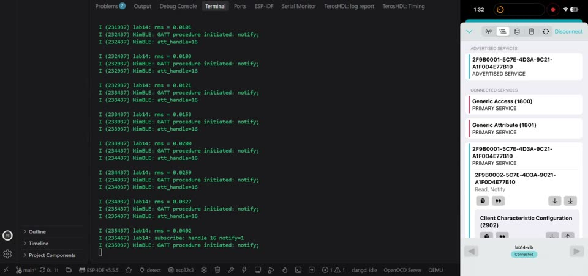
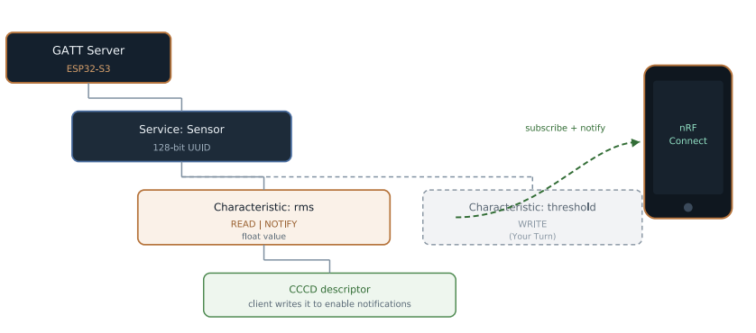
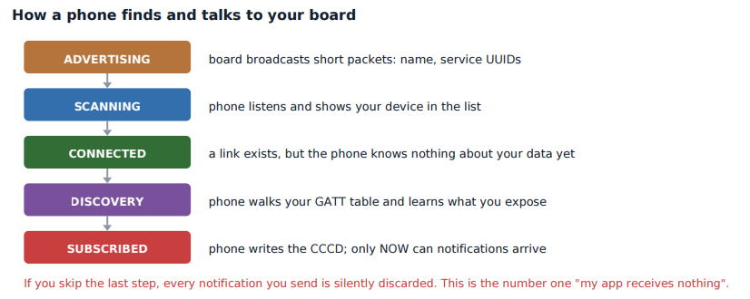

# Lab 14: BLE GATT Server with NimBLE

A Bluetooth Low Energy peripheral. The board advertises as `lab14-vib`, exposes a custom service with one characteristic carrying the live RMS value, and pushes it to a phone with notifications. Verified in nRF Connect.

<a href="screenshots/lab14_demo_ble_notify_phone_and_log.mp4"></a>

*Click to play. Left: the board logs `connected`, `subscribe ... notify=1` and each notify. Right: nRF Connect finds `lab14-vib`, connects, and the value updates on its own.*

| GATT table | Connection steps |
|---|---|
|  |  |

| | |
|---|---|
| **Board** | ESP32-S3 N16R8 |
| **Stack** | NimBLE (ESP-IDF host) |
| **Service** | 128-bit UUID `2F9B0001-5C7E-4D3A-9C21-A1F0D4E77B10` |
| **Characteristic** | `2F9B0002-...`, Read and Notify, 4 byte little-endian `float` RMS |
| **Key APIs** | `ble_gatts_count_cfg()`, `ble_gatts_add_svcs()`, `ble_gap_adv_set_fields()`, `ble_gap_adv_rsp_set_fields()`, `ble_gap_adv_start()`, `ble_gatts_notify_custom()` |
| **Tools** | nRF Connect on iPhone |

## How it works

- **GATT is a table.** A service groups characteristics, a characteristic holds a value plus flags, and the CCCD descriptor is where the phone writes to turn notifications on.
- **Read vs Notify.** Read is pull: the phone asks and `vib_access_cb` answers with the current value. Notify is push: the board sends every 500 ms without being asked, which is how real BLE sensors work.
- **Nothing shows up until the phone subscribes.** The board calls `ble_gatts_notify_custom()` every 500 ms whether or not anyone subscribed, because that call does not check the CCCD. The phone only shows the values after it writes the CCCD, which the board logs as a `BLE_GAP_EVENT_SUBSCRIBE`. Skipping that step is the number one "my app receives nothing" bug.
- **BLE has no types.** The value is 4 raw bytes. `CD CC 4C 3D` reversed is `0x3D4CCCCD`, which is IEEE-754 for 0.05, matching the first `rms = 0.0500` in the log. Byte order and float layout, worked by hand.
- **The connection handle goes stale.** On disconnect the stored handle is cleared and advertising restarts, so a dead handle is never used for a notify.

## Results

| Check | Result |
|---|---|
| Advertises | `lab14-vib` shows in the nRF Connect scanner with its service UUID |
| Connects | `connected (handle 1)` and an MTU of 256 |
| Read works | Returns the current float bytes on demand |
| Notify works | `subscribe: handle 16 notify=1`, then values stream every 500 ms |
| Disconnect | Board logs it and goes back to advertising |

## What broke

- **The phone could not find the board at all.** The log said `adv_set_fields rc=4`. A BLE advertising packet holds 31 bytes, and flags (3) + TX power (3) + the name (11) + a 128-bit UUID (18) is 35. The function returned before advertising ever started. I kept the name in the advertising packet and moved the UUID to the **scan response**, a second 31-byte packet the phone asks for.
- **Values that looked like garbage.** They were correct, just raw little-endian float bytes. nRF Connect shows hex because BLE carries no type information.

## Build

```powershell
idf.py build flash monitor
```

In nRF Connect: Scan, connect to `lab14-vib`, open the custom service, tap the triple-arrow to subscribe.
