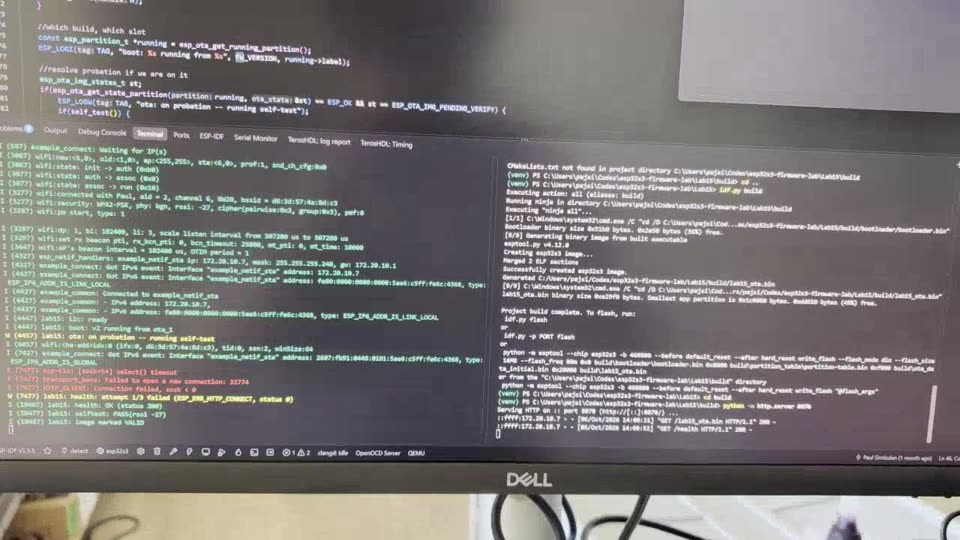
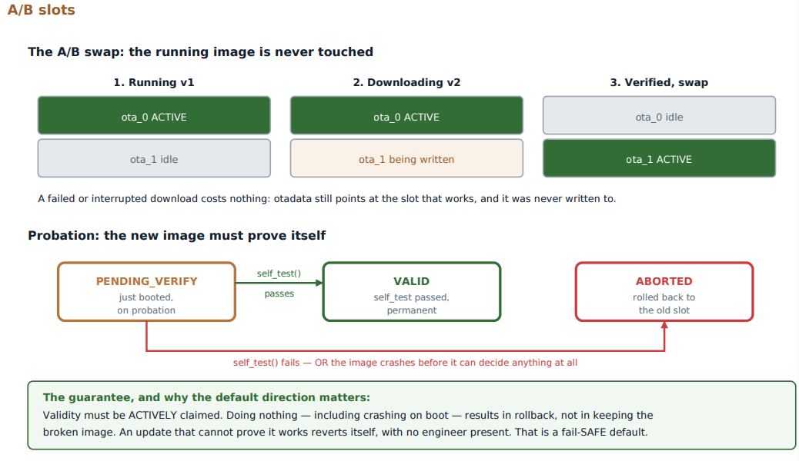
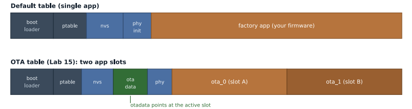
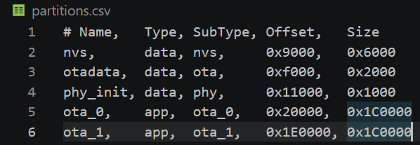

# Lab 15: OTA Updates with Rollback

Updating firmware over Wi-Fi, and more importantly surviving a bad update. Two app slots, a probation state, an on-device self-test, and automatic rollback when the self-test fails. I captured both paths on the bench: a good v2 that commits, and a v2 that fails its self-test and rolls itself back to v1.

[](screenshots/lab15_demo_ota_update_v1_to_v2.mp4)

*Click to play (the quiet middle part is sped up). v1 downloads the new image from the laptop, reboots into the other slot, v2 passes its self-test, and the image is marked valid.*



| Partition tables | `partitions.csv` |
|---|---|
|  |  |

| | |
|---|---|
| **Board** | ESP32-S3 N16R8, 16 MB flash |
| **Partitions** | `ota_0` and `ota_1` at 1.75 MB each, plus `otadata` and `nvs` |
| **Subsystems** | `esp_https_ota`, `app_update`, bootloader rollback, NVS |
| **Key APIs** | `esp_https_ota()`, `esp_ota_get_running_partition()`, `esp_ota_get_state_partition()`, `esp_ota_mark_app_valid_cancel_rollback()`, `esp_ota_mark_app_invalid_rollback_and_reboot()` |
| **Config** | `CONFIG_BOOTLOADER_APP_ROLLBACK_ENABLE`, `CONFIG_ESP_HTTPS_OTA_ALLOW_HTTP`, 16 MB flash |
| **Host** | `python -m http.server 8070` serving the new `.bin` and a `/health` file |

## How it works

- **Two slots and a pointer.** An update is written into the slot that is not running, so a failed download leaves the working image untouched. The last step flips the pointer in `otadata`.
- **Probation.** A new image boots as `PENDING_VERIFY`. It has to prove itself and call mark-valid. If it fails, or crashes before it can decide, the bootloader goes back to the old slot. The safe outcome is the default.
- **The self-test is the engineering.** Downloading is a library call. Deciding what "working" means is the design. Mine checks three things: the NVS namespace exists, the IMU answers on I2C, and the update server is reachable (a `GET /health` that must return 2xx, with retries).
- **Version and slot in every log line.** `boot: v2 running from ota_1` makes it impossible to confuse which image is running.

## Rollback, caught for real

The first OTA run on the bench went v1 to v2 correctly, and then this happened:

```
boot: v2 running from ota_1
ota: on probation -- running self-test
IMU no ACK
self-test FAILED -- rolling back
esp_ota_ops: Rollback to previously worked partition.
...
boot: v1 running from ota_0
```

The IMU was not plugged in, so v2 failed its own check and put v1 back with nobody touching the board. With the IMU wired, the same v2 logged `health: OK`, `selftest: PASS` and `image marked VALID`, and stayed on `ota_1`.

## Coming from the TM4C123

No equivalent. Updating a TM4C meant a probe and physical access. Every idea here exists because the device is somewhere you are not.

## Results

| Case | Result |
|---|---|
| Missing file on the server (404) | `ota: failed`, stays on the current image |
| Server not running | `ESP_ERR_HTTP_CONNECT`, stays on the current image |
| v2 with a failing self-test | Rolls back to v1 in `ota_0` automatically |
| v2 with a passing self-test | Commits, stays on `ota_1` |

## What broke

- **Rollback never armed, and nothing said so.** `CONFIG_BOOTLOADER_APP_ROLLBACK_ENABLE` is off by default. Without it the image is never on probation, and mark-valid and mark-invalid both quietly return OK. A safety feature that silently does nothing is worse than none, so I made sure the failure path really fails.
- **`sdkconfig.defaults` edits that did nothing.** They only apply when no `sdkconfig` exists, and old option names are silently ignored. Check the generated `sdkconfig`, not what you typed.
- **2 MB flash default.** Two app slots do not fit. Set 16 MB.
- **`/health` returned 404.** `python -m http.server` serves files, so an empty file named `health` in the served folder is enough.
- **v2 re-downloaded itself every boot.** The OTA task ran in every build. Now only v1 looks for an update.

## Build

```powershell
idf.py menuconfig          # Wi-Fi credentials
idf.py build flash         # flash v1 over USB
# set FW_VERSION to "v2", then:
idf.py build               # do not flash
cd build; python -m http.server 8070
```

Then reset the board and watch it update itself.
