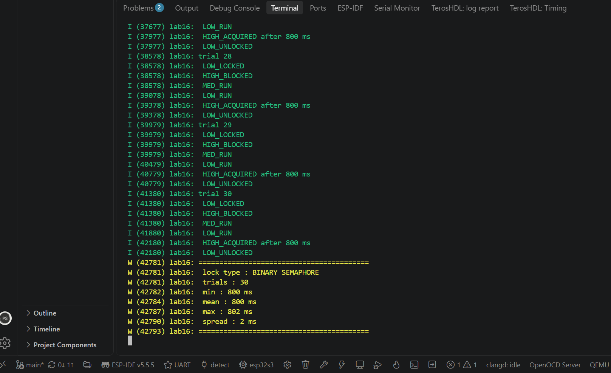
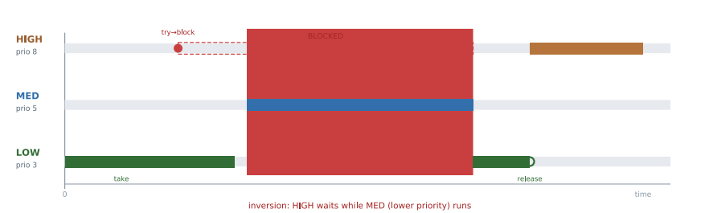
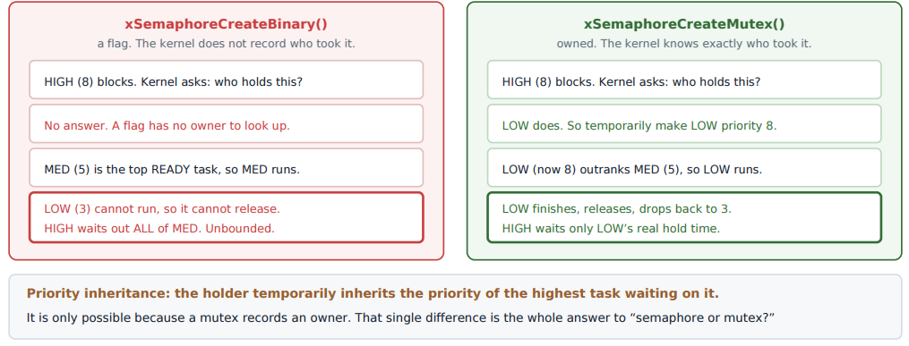

# Lab 16: Priority Inversion and Mutexes

Causing the most-asked RTOS interview problem on purpose, timing it, and fixing it by changing one line: a binary semaphore becomes a mutex.

| Binary semaphore: HIGH waits 800 ms | Mutex: HIGH waits 300 ms |
|---|---|
|  |  |

*Same three tasks, 30 trials each. With a binary semaphore the high priority task waits 800 ms (LOW's 300 ms hold plus all 500 ms of MED). With a mutex it waits 300 ms, just LOW's real hold time. Spread is 2 ms in both runs.*

| The inversion | Why a mutex fixes it |
|---|---|
|  |  |

| | |
|---|---|
| **Board** | ESP32-S3 N16R8, all tasks (including the control task) pinned to core 0 |
| **Tasks** | LOW priority 3 (holds the lock 300 ms), MED priority 5 (runs 500 ms, needs no lock), HIGH priority 8 (wants the lock), CTRL priority 9 (starts each trial and prints the summary) |
| **Key APIs** | `xSemaphoreCreateBinary()` vs `xSemaphoreCreateMutex()`, task notifications to sequence the trial, `esp_timer_get_time()` |
| **Switch** | `#define USE_MUTEX 0` for Part A, `1` for Part B |

## How it works

- **The setup.** LOW takes the lock. HIGH wants it and blocks, which is normal. Then MED wakes up. MED outranks LOW and needs no lock, so it runs, and LOW cannot run to release. HIGH, the most important task, ends up waiting on MED, a task it has nothing to do with.
- **Real world.** Mars Pathfinder kept resetting in 1997 for exactly this reason. The fix sent from Earth was turning on priority inheritance.
- **Why a mutex fixes it.** A mutex has an owner. When HIGH blocks, the kernel raises LOW to HIGH's priority, so LOW beats MED, finishes and releases. A binary semaphore has no owner, so there is nobody to promote.
- **The actual difference.** A mutex is owned, taken and given by the same task, and protects a resource. A semaphore is a signal, given by one task or ISR and taken by another. That is why Lab 7 correctly uses semaphores.
- **Making it deterministic.** Each trial is sequenced with task notifications, not sleeps, so the order lock, block, preempt is forced every time.

## Results

| | Binary semaphore | Mutex |
|---|---|---|
| Trials | 30 | 30 |
| HIGH wait, min | 800 ms | 300 ms |
| HIGH wait, mean | 800 ms | 300 ms |
| HIGH wait, max | 802 ms | 302 ms |
| Order of events | LOW locks, HIGH blocks, **MED runs**, LOW runs | LOW locks, HIGH blocks, **LOW runs**, HIGH acquires, then MED |

## What broke

- **The first version proved nothing.** It staggered the tasks with tuned `vTaskDelay` values, so HIGH always woke after the lock was already free. Both versions measured zero wait and "showed" that mutexes make no difference. A result of zero for both cannot be right, and chasing that is what turned it into a real experiment. A concurrency demo built on sleeps is just a race that usually goes one way.
- **Tick resolution.** At a 100 Hz tick, short waits round to 0 or 10 ms. The tick is 1 kHz here and the wait is measured in microseconds with `esp_timer`.

## Build

```powershell
idf.py build flash monitor
```

Run once with `USE_MUTEX 0` and once with `USE_MUTEX 1`. The summary prints after 30 trials.
