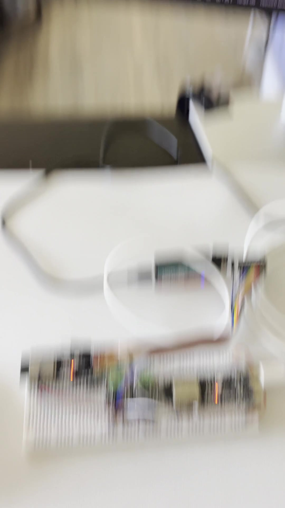
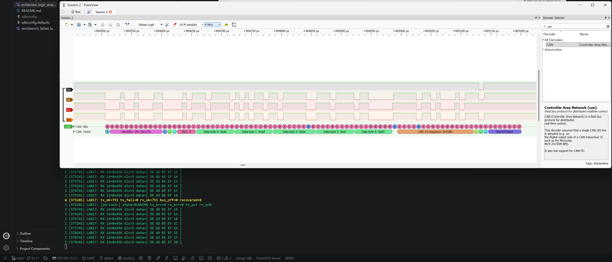
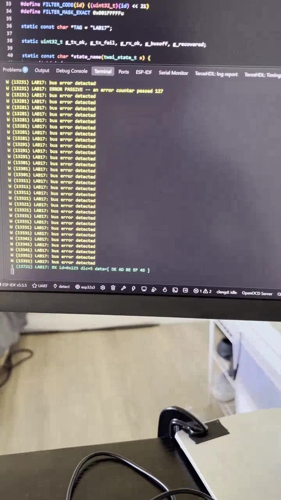
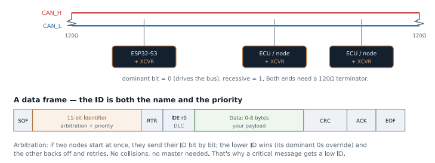
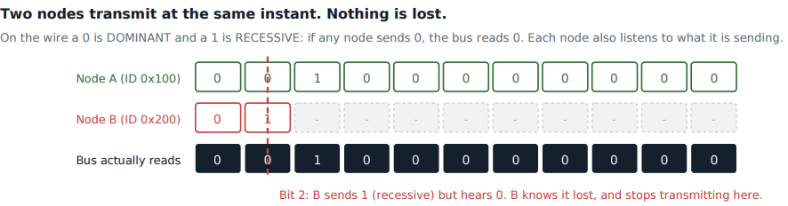

# Lab 17: CAN Bus (TWAI) with Two Nodes

The bus inside cars and industrial machines. Two ESP32-S3 boards, each with its own CAN transceiver, talking over one twisted pair: broadcast IDs, hardware acceptance filters, the ACK bit, error counters and bus-off recovery.


*PulseView decodes Node 2's frame: ID `0x456`, DLC 5, `DE AD BE EF 8A`, CRC and end of frame. The flat trace that dips once near the end is Node 1's TX driving the ACK bit. The log below shows `tx_ok=511 tx_fail=0 bus_off=0`.*

[](screenshots/lab17_demo_can_two_nodes_125k.mp4)

*Click to play. Both boards on the bus at 125 kbit/s, each receiving the other's ID every 500 ms with zero errors.*

| Node 1's frame, the other direction | The 500 kbit/s failure |
|---|---|
|  | [](screenshots/lab17_demo_can_500k_bus_errors_bus_off.mp4) |

| The bus and a frame | Arbitration |
|---|---|
|  |  |

| | |
|---|---|
| **Boards** | 2x ESP32-S3 N16R8 |
| **Transceivers** | 2x Adafruit CAN Pal (NXP TJA1051T/3), onboard 120 Ω termination on both |
| **Pins** | GPIO5 TX and GPIO4 RX on each board, SLNT tied to GND |
| **IDs** | Node 1 sends `0x123` and accepts only `0x456`. Node 2 is the mirror |
| **Bit rate** | 125 kbit/s (clean). 500 kbit/s fails on my wiring, see below |
| **Key APIs** | `twai_driver_install()`, `twai_start()`, `twai_transmit()`, `twai_receive()`, `twai_read_alerts()`, `twai_initiate_recovery()` |
| **Tools** | Logic analyzer on both nodes' TX and RX at 4 MHz, PulseView CAN decoder |

## How it works

- **Broadcast, not addressed.** A frame's ID says what it is, not who it is for. Every node hears every frame and keeps what it cares about. Adding a listener changes nothing on the sender.
- **Arbitration.** A 0 is dominant and wins over a 1. Every sender reads the bus while sending its ID, and whoever sends a 1 but reads a 0 backs off right away. The winner's frame is untouched. Lower ID means higher priority.
- **The ACK bit.** Every frame needs at least one other node to drive the ACK slot. That one dip in the capture is the proof that two real nodes are talking.
- **Hardware filter.** The acceptance filter drops other IDs before any interrupt fires. The mask is inverted from what you would expect (1 means don't care), so `0x123` sits in the top 11 bits as `0x24600000` with mask `0x001FFFFF`.
- **Error states.** At 128 a node goes error passive. Above 255 it goes bus-off and removes itself, so one broken node cannot jam the bus. `twai_initiate_recovery()` brings it back.
- **The transceiver is just the voice.** The CAN protocol lives in the ESP32's TWAI controller. The CAN Pal only turns TX and RX logic levels into the CANH/CANL differential pair. CANH and CANL never touch an ESP32 pin.
- **One file, two nodes.** `#define NODE 1` or `2` picks the IDs. `#define TWO_NODE 0` brings back the single board self-test.
- **Stuff bits.** The blue bits in the decoder row are stuff bits. After five equal bits CAN inserts an opposite one so receivers stay in sync.

## The 500 kbit/s problem

At 500 kbit/s both nodes still received many of each other's frames, but every time a node transmitted it hit a burst of bit errors and went bus-off, then recovered, over and over. Same code on both boards and data still crossing in both directions meant firmware was unlikely.

Checked against the NXP TJA1051 datasheet: 250 ns max loop delay and rated to 5 Mbit/s, and the CAN Pal has a 5 V charge pump and pulls SLNT low internally. So on paper the parts handle 500k easily. Dropping both boards to 125 kbit/s made the bus completely clean (thousands of frames, `tx_fail=0`, `bus_off=0`). That points at the wiring between the transceivers (connections, wire length, or termination) rather than the chips. The fix I have not confirmed yet is measuring about 60 Ω across CANH and CANL with power off and tidying the bus wiring, then going back to 500k.

## Earlier attempt

My first try used one ESP32 with two cheap SN65HVD230 breakouts, one transmitting and one listening. Single transceiver loopback passed on all three boards, but the two-transceiver path always went bus-off. It was really one controller talking to itself, so I rebuilt the test as a real two-node network with two boards and new transceivers.

## Coming from the TM4C123

The TM4C123 has a CAN controller and ECE 425 never touched it. Nothing to bridge from.

## Results

| Check | Result |
|---|---|
| Two-way traffic | Each node receives the other's ID with an incrementing counter |
| ACK | Visible on the sender's partner TX line in every frame |
| Filtering | Each node only sees the other's ID, never its own |
| Errors at 125 kbit/s | `tx_err=0 rx_err=0`, `bus_off=0` after 500+ frames |
| Errors at 500 kbit/s | Bit errors on transmit, bus-off and recovery every cycle |

## What broke

- **Bus-off proof drowned in its own logging.** The alert handler logged every bus error, hundreds of lines a second. Counting errors and printing the count on the stats line made the bus-off transition visible. Fault handlers count, they do not narrate.
- **`tx_ok` does not mean sent.** `twai_transmit()` returns OK when the frame is queued. Reading `tx_q` is what tells you if anything left.
- **A cold solder joint** on one of the first breakouts. Header pin read 3.3 V while the IC leg read 0 V.
- **MCP2551 is a 5 V part** and the ESP32 pins are not 5 V tolerant. Checked before wiring.
- **CANH and CANL on a logic analyzer show nothing useful.** CANH sits above the logic threshold at both levels and CANL straddles it. Probe TX and RX, or use a scope for the pair.

## Build

```powershell
# board 1
idf.py -p COM_A build flash monitor     # NODE 1
# change to NODE 2, then board 2
idf.py -p COM_B build flash monitor
```

Each CAN Pal: VCC to 3V3, GND to GND, TX to IO5, RX to IO4, SLNT to GND. Between them: CANH to CANH, CANL to CANL, GND to GND, termination switches on.
