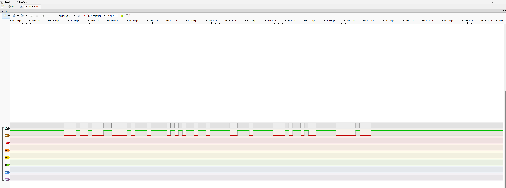
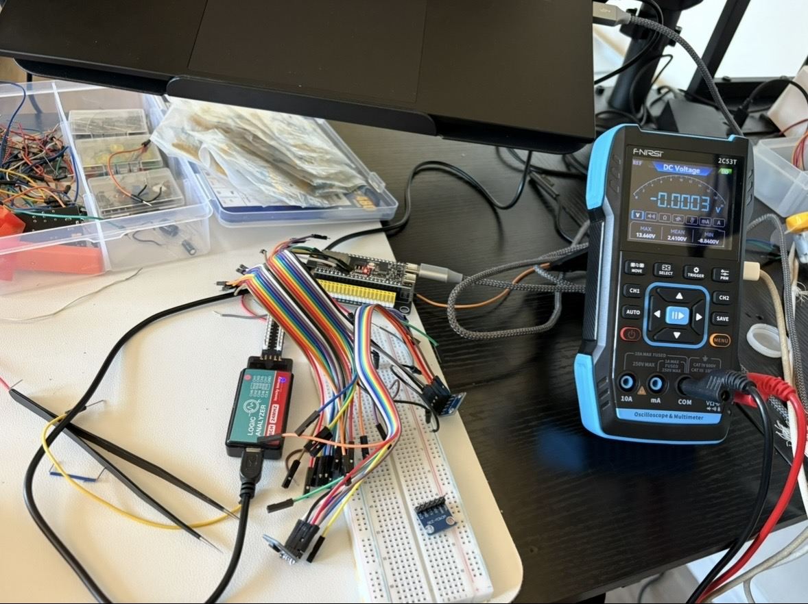

# Lab 17: CAN Bus (TWAI)

The bus that runs vehicles, industrial machinery, and a lot of aerospace. Message-ID broadcast instead of addressing, non-destructive bitwise arbitration, hardware acceptance filters, error counters, and the bus-off state.

| | |
|---|---|
| **Target** | ESP32-S3 N16R8, TWAI controller |
| **Pins** | GPIO5 TX, GPIO4 RX |
| **Part A** | Self-test loopback, `.self = 1`, no external hardware — **complete** |
| **Part B** | Two transceivers on a shared differential pair — **unresolved, see below** |
| **Bit rate** | 500 kbit/s |
| **Key APIs** | `twai_driver_install()`, `twai_start()`, `twai_transmit()`, `twai_receive()`, `twai_read_alerts()`, `twai_get_status_info()` |

---

## Objective

CAN is a named question at SpaceX and across the automotive and defense tiers, and it is a bus almost no student project touches. Espressif calls its controller **TWAI** (Two-Wire Automotive Interface) for trademark reasons, but `twai_*` is CAN.

---

## How it works

### Messages are broadcast, not addressed

There is no destination. A frame carries an **identifier** describing what the message *is* (engine RPM, brake pressure) rather than who it is for. Every node sees every frame and decides for itself whether it cares. Adding a listener requires no change to the transmitter, which is why the bus scales.

### Arbitration is non-destructive

The bus is wired-AND: a dominant bit (0) wins over a recessive bit (1). Every transmitter monitors the bus while sending its ID, and any node that sends recessive while reading dominant knows it lost and stops immediately. The winner's transmission is **not corrupted** and continues without a retry. Lower ID numerically means higher priority.

Compare with Ethernet's CSMA/CD, where a collision destroys both frames and both parties back off randomly. CAN resolves contention deterministically with no wasted bandwidth, which is why it is used where latency has to be bounded.

### Why self-test mode exists

Every CAN frame must be **acknowledged by at least one other node**, which writes a dominant bit in the ACK slot. `TWAI_MODE_NO_ACK` waives that requirement and `.self = 1` asks the controller to receive its own transmission, so a single board can prove its own peripheral. These are two separate settings and the loopback needs both — setting only the mode gives you the confusing symptom of `tx_ok` climbing while `rx_ok` stays at zero.

Same "prove the peripheral before adding the device" discipline as the UART loopback in Lab 3 and the SPI loopback in Lab 9, but here it exists because of a protocol property rather than as a convenience.

### Error states

CAN nodes maintain transmit and receive error counters. At 128 a node becomes **error-passive** and stops asserting dominant error flags. Above 255 it goes **bus-off**, disconnects itself entirely, and requires explicit recovery. This is fault containment: a node with a broken transceiver babbling on the bus takes itself out rather than jamming everyone. `twai_initiate_recovery()` is how it comes back.

Worth noting that NO_ACK does **not** disable transmit-bit monitoring. The controller still reads back every bit it drives, so a bad return path still produces bit errors and still drives the node to bus-off. That is exactly what happened in Part B.

### Termination

Exactly **two 120 Ω resistors, at the two physical ends of the bus**, regardless of how many nodes are on it. This is a transmission-line requirement, not a per-node one. Three nodes still means two resistors. The WCMCU-230 breakouts carry one each, so two boards give the correct 60 Ω.

---

## Proof cases

| # | Case | Result |
|---|---|---|
| 1 | Self-test loopback with an incrementing counter byte | **Pass.** `DE AD BE EF nn` received back with the counter incrementing, every 500 ms, zero error counters |
| 2 | Hardware acceptance filter | **Pass.** Sending ID `0x456` against a filter set for `0x123`: `tx_ok` climbs, `rx_ok` stays at zero, error counters stay at zero |
| 3 | Bus-off and recovery | **Pass.** Error counters climb, the node transitions to bus-off, `twai_initiate_recovery()` brings it back, confirmed through `twai_get_status_info()` |
| 4 | Two transceivers on a real differential pair | **Not completed.** See "Part B: unresolved" |

Case 2 is the one worth understanding rather than just running. The filter is in **hardware**: the frame is received by the controller, compared against the acceptance mask, and discarded before any interrupt fires. On a busy vehicle bus carrying thousands of frames per second, that is the difference between a CPU that can do its job and one that spends all its time rejecting other people's traffic.

The mask convention is inverted from intuition — a `1` bit means **don't care**. With 11-bit standard IDs the code sits in the top 11 bits of a 32-bit word, so `0x123` becomes `0x24600000` and an exact-match mask is `0x001FFFFF`.

---

## TM4C123 bridge

The TM4C123 has a CAN controller, and ECE 425 never touched it. No bridge to draw. The nearest concept from the coursework is UART framing, and CAN's differential signalling, arbitration, and error confinement are all past it.

---

## Part B: unresolved

Part A is done and verified. The two-transceiver bus is not, and I stopped after roughly three hours rather than keep burning time on it. Logging it honestly, because the elimination trail is more useful than a guess at a root cause.

### Hardware

3x WCMCU-230 breakout boards (SN65HVD230, 3.3 V), labeled A, B, C. Headers soldered by hand. One ESP32-S3, so this is **one CAN controller with two transceivers** — external loopback across a differential pair, not a two-controller network.

### The failing configuration

```
GPIO5 -> A.CTX          A drives the pair
GPIO4 -> B.CRX          B listens
A.CANH -- B.CANH
A.CANL -- B.CANL
3V3 / GND shared
A.CRX unconnected, B.CTX tied high
```

```text
ERROR PASSIVE -- an error counter passed 127
bus error detected
BUS-OFF. the node removed itself from the bus
[bus-off] state=BUSS_OFF tx_err=128 rx_err=0 tx_q=1 rx_q=0
recovered. restarting the driver
[recovered] state=RUNNING tx_err=0 rx_err=0 tx_q=0 rx_q=0
```

Repeating every 500 ms, matching the send interval. `rx_ok` never leaves zero. Errors are entirely on the transmit side.

### What was eliminated

| Test | Result |
|---|---|
| Loopback on A alone | Pass, clean for 50+ seconds |
| Loopback on B alone | Pass |
| Loopback on C alone | Pass |
| Add powered B to the pair, still receive through A.CRX | Pass — B on the bus does not disturb A |
| Move only GPIO4 from A.CRX to B.CRX | **Fail, immediate bus-off** |
| Resistance A.CANH to B.CANH | ~0 Ω, continuity good |
| Resistance A.CANL to B.CANL | 0.2–0.3 Ω, continuity good |
| Resistance A.CANH to B.CANL | 60 Ω — two 120 Ω terminators in parallel, no H-to-L short, pair not crossed |

So: firmware ruled out (same binary passes loopback), all three transceivers ruled out individually, GPIO wiring ruled out, termination ruled out, crossed pair ruled out. One wire is the difference between pass and fail.

### Logic analyzer



D0 on A.CTX, D1 on A.CRX, D2 on B.CRX, 10 M samples at 12 MHz. D0 and D1 track each other — A transmits and A's own receiver follows. D2 stays flat high through the whole burst. B's receiver output never shows the pulses A is putting on the pair.

That is consistent with the bus-off signature: if GPIO4 sees permanent recessive while the controller drives dominant, every dominant bit is a bit error and the node walks straight to bus-off.

What it does **not** establish is why. B's receiver demonstrably works, because B passed loopback using that same CRX pin. The D2 probe contact was never independently verified either — the obvious check, moving D2 onto A.CRX alongside D1 to prove the channel, was not run.

### Where it stands

Genuinely unresolved. Leading candidates, none confirmed:

- Something in the A-to-B analog path that continuity testing does not catch
- A header-to-IC-leg connection that reads fine at DC but fails at 500 kbit/s (all three boards were hand-soldered, and one of them — board A — already had a confirmed cold joint that was found and reflowed earlier in the session)
- The D2 analyzer channel itself, which was never validated

The next test I would run is the reverse direction: GPIO5 to B.CTX, GPIO4 to A.CRX, everything else unchanged. If that passes, the fault is directional and sits in B's receive path. If it fails identically, it is the shared bus wiring.



---

## What broke

**The bus-off proof case drowned in its own logging.**
`twai_read_alerts()` reports `TWAI_ALERT_BUS_ERROR`, and with no ACKing node that alert fires on essentially every bit time. Logging inside the alert handler produced **hundreds of lines per second**, and the actual bus-off transition scrolled past invisibly in the flood.

Fix: count the errors instead of logging them, and report the count on the existing periodic stats line. The transition became immediately visible.

This is a production pattern rather than a lab workaround. Log volume in an error path is a design decision, and a handler that logs per-event on a fault that fires at bus rate is a denial of service against your own console. Fault handlers count and rate-limit; they do not narrate.

**A cold solder joint on one breakout.**
Board A initially showed nothing on CRX, CANH or CANL with the supply pin reading correctly. Isolated by swapping known-good boards into the same fixed test rig rather than by probing, then confirmed at the IC leg, reflowed, and it passed. Header pin reading 3.3 V while the IC leg reads 0 V is the specific signature — solder balled on the pin without wetting the pad.

**`tx_ok` does not mean transmitted.**
`twai_transmit()` returns `ESP_OK` when the frame is **queued**, not when it is on the wire. During one failure the counter froze at exactly 11 — a 10-deep queue plus one in the transmit buffer — with every error counter at zero. That combination means the controller never started transmitting at all, which happens when RX is stuck dominant and the bus never looks idle. A different failure mode entirely from the bus-off case, and the only thing that distinguishes them is reading `tx_q` rather than `tx_ok`.

**The SN65HVD230 Rs pin.**
Breakout boards vary in how the slope-control / standby pin is handled, and left in the wrong state the transceiver appears dead with no error anywhere: the controller reports transmissions succeeding into a bus that carries nothing. A silent failure at the layer below the one you are debugging, which is the worst kind. The WCMCU-230 grounds it on the board.

**MCP2551 is a 5 V part.**
Frequently sold as an interchangeable CAN transceiver and frequently mislabelled in listings. The ESP32-S3's GPIO pins are **not 5 V tolerant**. SN65HVD230 is the 3.3 V part. Checked before wiring rather than after.

**A DMM cannot see CAN frames.**
At a 500 ms send interval a 5-byte frame at 500 kbit/s occupies about 0.04% of the time. The bus is recessive essentially always, so static voltage readings show a clean idle whether the link works or not. Several measurements early in the session were wasted on this before switching to counters and the analyzer. Related: with firmware running, hand-jumpering CTX to a rail fights the ESP32's output driver and produces a meaningless mid-rail reading — GPIO5 has to come off first.

**Six defects in my own first implementation.**
Enum name typos, a stray character, a missing include, an unused variable warning, and two behavioural bugs: a missing counter variable that made the payload constant so loopback appeared to work while proving nothing, and a missing trailing space in a `sprintf` format string that truncated the RX log. The constant-payload one is the instructive one, because it produced output that looked exactly like success.

---

## Reference

SN65HVD230 SOIC-8, and the header mapping on the WCMCU-230:

```
        +---U---+
D    1 -| .     |- 8  Rs        header: CTX=1  GND=2  3V3=3
GND  2 -|       |- 7  CANH              CRX=4  CANL=6 CANH=7
VCC  3 -|       |- 6  CANL
R    4 -|       |- 5  Vref       pins 5 and 8 are not broken out
        +-------+
```

Static levels at 3.3 V, black probe on GND, GPIO5 disconnected from CTX:

| State | CANH | CANL | CRX |
|---|---|---|---|
| Recessive (CTX high) | ~1.5 V | ~1.5 V | ~3.3 V |
| Dominant (CTX low) | ~2.5 V | ~0.5 V | ~0 V |

Recessive common mode is Vcc/2. The 2.3 V figure that appears in a lot of tutorials is the 5 V part.

---

## Build

```powershell
idf.py set-target esp32s3
idf.py build
idf.py -p COM3 flash monitor
```

Part A: jumper GPIO5 to GPIO4, `TWAI_MODE_NO_ACK` and `.self = 1`.
Part B: SN65HVD230 on each node, CANH to CANH, CANL to CANL, common ground, 120 Ω at both physical ends.
Analyzer: 10 M samples at 12 MHz, no trigger — covers at least one 500 ms send interval.

One toolchain note: the `build/` directory is not relocatable. CMake bakes absolute paths into `CMakeCache.txt`, so after moving or re-cloning a project you have to delete it by hand — `idf.py fullclean` refuses, because it validates the cache before deleting and the cache is what is broken.

---

## References

- ESP-IDF Programming Guide v5.5, *Two-Wire Automotive Interface (TWAI)*
- ESP32-S3 Technical Reference Manual, Chapter 33 (TWAI Controller)
- Bosch CAN Specification 2.0, ISO 11898
- TI SN65HVD230 datasheet