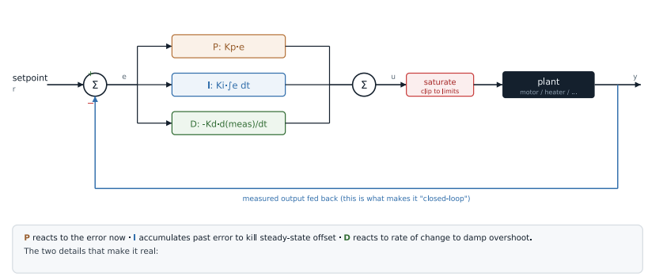
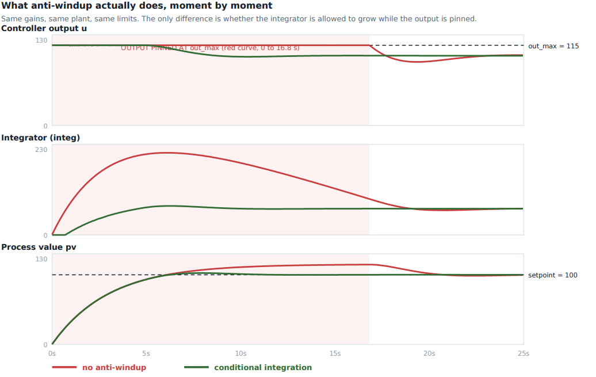

# Lab 18: PID Control with Anti-Windup

A discrete PID controller running at a fixed 10 ms rate on the ESP32-S3 against a simulated first-order plant. Three runs from the same code with the same gains: P only, PI without anti-windup, and PI with anti-windup. The board's own CSV output, plotted.


*Plotted from the CSV the board printed. P-only settles at 60 and never reaches 100. PI without anti-windup reaches 100 but overshoots by 14.6. PI with anti-windup overshoots by only 2.5. Bottom panel: without anti-windup the output (red) stays pinned at the 115 limit long after the setpoint is reached.*

| The loop | What anti-windup does |
|---|---|
|  |  |

| | |
|---|---|
| **Board** | ESP32-S3 N16R8 |
| **Loop** | 10 ms fixed interval (`DT_MS 10`), 40 s per run |
| **Plant** | Simulated first-order system, time constant 3 s. Controller output clamped to 0..115 |
| **Gains** | Kp 1.5, Ki 0 or 1.5, Kd 0 |
| **Switch** | `#define MODE 0` P only, `1` PI no anti-windup, `2` PI with anti-windup |
| **Output** | CSV `t,setpoint,pv,u` over serial, plus a summary box |

## How it works

```
error    = setpoint - measurement
integral += error * dt
output   = Kp*error + Ki*integral (+ Kd term)
```

- **`dt` has to be constant.** That is why the loop runs at a fixed rate like the sampler in Lab 7. If `dt` drifts, Ki and Kd are multiplied by a random number every step.
- **Why P alone never gets there.** A P controller needs a nonzero error to produce any output, so it settles where output and plant balance. Here that is 60, a permanent 40 unit offset.
- **Windup.** Every real actuator saturates. While the output sits at its limit the error stays large and the integral keeps growing. Once the plant reaches the setpoint, all that stored integral has to unwind before the output can come down, which is the overshoot.
- **The fix used here, conditional integration.** Stop adding to the integral while the output is saturated and pushing the same way.
- **Derivative on measurement.** Differentiating the measurement instead of the error avoids a huge spike when the setpoint steps. Kd is 0 in these runs, so this is really PI. The derivative term amplifies noise, which is why it is often left off.

## Results

| Controller | Peak | Overshoot | Final offset |
|---|---|---|---|
| P only | 60.0 | 0 | 40.0 |
| PI, no anti-windup | 114.6 | 14.6 | 0 |
| PI with anti-windup | 102.5 | 2.5 | 0 |

Anti-windup cut overshoot from 14.6 to 2.5 with the same gains, plant and limits. The two PI runs differ by a couple of lines of code. Full 40 second plot: [`lab18_proof_step_response_board.png`](screenshots/lab18_proof_step_response_board.png). Raw board output is in `data/`.

The plant is simulated on purpose. That is a demonstration of the algorithm and its failure modes, not tuning a real motor, and those are different claims.

## What broke

- **The anti-windup check was inverted and made things worse.** It integrated only while saturated, the exact opposite of the fix. It still converged and looked plausible, it just overshot more than no protection at all. I caught it by comparing the three runs and seeing the order was wrong: the protected case cannot be worse than the unprotected one. Control code fails quietly.
- **Two small logging bugs.** The startup line printed `ki` in the `out_max` slot, and the CSV header had `\"n` instead of `\n`, which glued the header onto the first row and broke pasting into a spreadsheet.

## Build

```powershell
idf.py build flash
idf.py monitor | Tee-Object mode0.txt
```

Repeat for `MODE 1` and `MODE 2`, then plot `pv` and `setpoint` against `t`.
