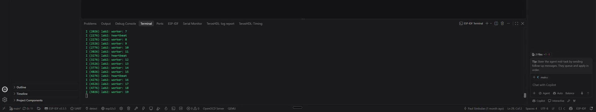
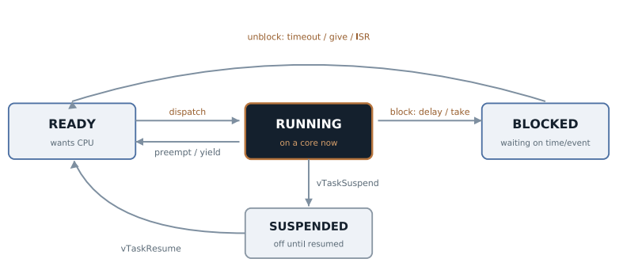

# Lab 2: FreeRTOS Tasks and Drift-Free Timing

Moving from a superloop to a preemptive RTOS. Two tasks with their own stacks, blocking instead of busy waiting, and the difference between a delay that drifts and a period that does not.

[](screenshots/lab02_demo_worker_and_heartbeat_tasks.mp4)

*Click to play. The 250 ms worker task and the 1 Hz heartbeat task print interleaved, which proves they really run side by side.*



| | |
|---|---|
| **Board** | ESP32-S3 N16R8, FreeRTOS (ESP-IDF SMP port) |
| **Hardware** | Board only |
| **Key APIs** | `xTaskCreate()`, `vTaskDelay()`, `vTaskDelayUntil()`, `pdMS_TO_TICKS()`, `xTaskGetTickCount()` |
| **Tasks** | `hb` and `wk`, 2048 byte stacks, both priority 5 |
| **Config** | Default tick, `CONFIG_FREERTOS_HZ=100` |

## How it works

- **A task is not a function you call.** `xTaskCreate()` gives each task its own stack and hands it to the scheduler. Each task is an endless loop. Here both tasks sit at priority 5, so neither starves the other. A higher priority task that becomes ready takes the CPU right away, even in the middle of a statement.
- **`app_main()` is just a task.** Once it has started the real tasks it can return and everything keeps running.
- **Blocking costs nothing.** `vTaskDelay()` puts the task to sleep and gives the CPU to whoever is ready. A busy wait burns the whole core doing nothing. That difference is the reason an RTOS exists.
- **Drift.** `vTaskDelay(1000 ms)` means 1000 ms from now, so if the work took 8 ms the real period is 1008 ms, and the error piles up. `vTaskDelayUntil()` waits until an absolute tick, so the period stays exact. This lab runs a 1 Hz heartbeat on `vTaskDelayUntil` and a 250 ms worker on `vTaskDelay` so both behaviors are in the same log.

## Results

| Check | Result |
|---|---|
| Tasks run concurrently | Heartbeat and worker lines interleave in the log |
| Heartbeat holds 1 Hz | Timestamps stay 1000 ms apart over a long run |
| Worker drifts | Its period runs long by its own work time, as expected |
| Blocked tasks are free | Idle task runs, no watchdog warnings |

## What broke

- **`vTaskDelay(1)` did not wait 1 ms.** ESP-IDF defaults the tick to **100 Hz**, so one tick is 10 ms and `pdMS_TO_TICKS(1)` rounds to zero, which is just a yield. Nothing warns you. This lab stays on the 100 Hz default since its delays are 250 ms and 1000 ms. Later labs that need finer delays set `CONFIG_FREERTOS_HZ=1000` in `sdkconfig.defaults`, and Lab 4 uses a hardware timer for anything faster.
- **Stack sizes picked by guessing.** Fine until a task uses `printf` with floats. Measured properly later with `uxTaskGetStackHighWaterMark()`.

## Build

```powershell
idf.py build flash monitor
```
