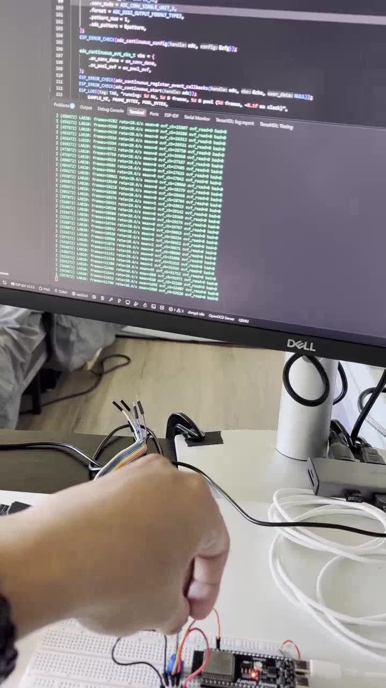
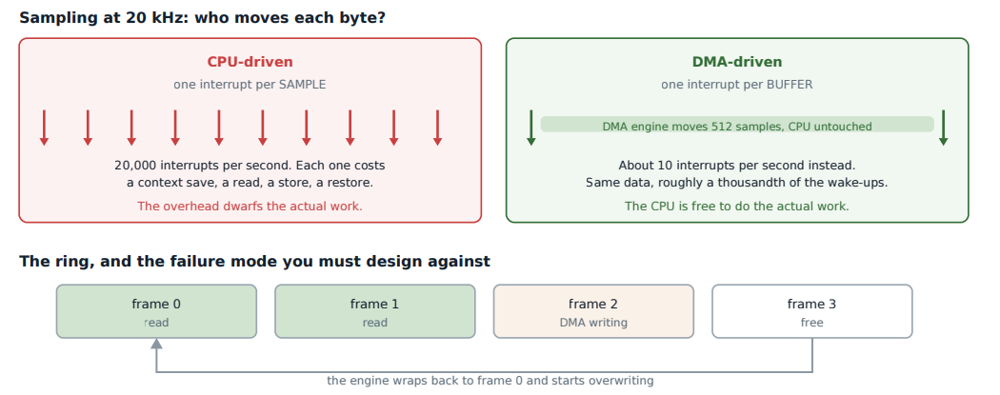
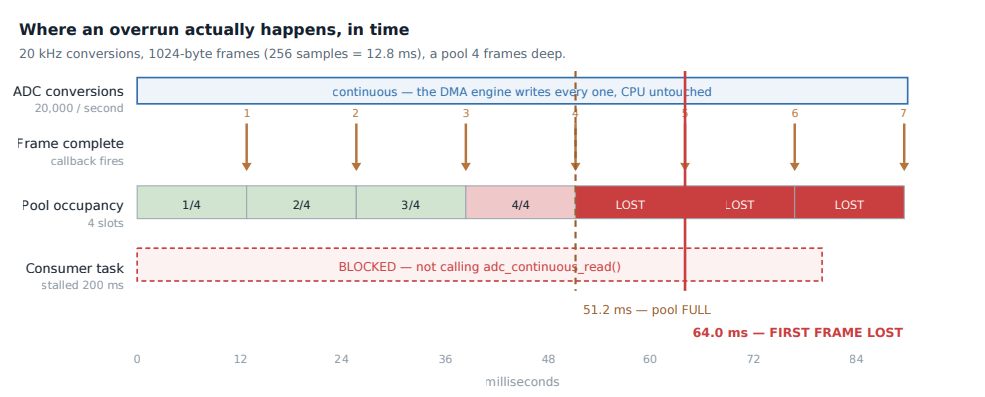

# Lab 20: Continuous ADC with DMA

Sampling a potentiometer at 20 kHz without the CPU touching a single sample. The ADC writes into a DMA pool in the background and the firmware only wakes up for full frames. Then I starve the reader on purpose to show what overflow looks like and that it gets reported, not hidden.

[](screenshots/lab20_demo_pot_sweep_dma_adc.mp4)

*Click to play. Turning the pot moves the per-frame mean from one rail to the other while frames keep arriving at a steady rate.*

| CPU polling vs DMA | Why overruns happen |
|---|---|
|  |  |

| | |
|---|---|
| **Board** | ESP32-S3 N16R8 |
| **Input** | Potentiometer wiper on IO1 (ADC1 channel 0) |
| **Rate** | 20 kHz, 12-bit |
| **Frames** | 1024 bytes = 256 samples = 12.8 ms, about 78 frames/s |
| **Pool** | 4 frames, about 38 ms of slack |
| **Key APIs** | `adc_continuous_new_handle()`, `adc_continuous_config()`, `adc_continuous_register_event_callbacks()`, `adc_continuous_read()` |

## How it works

- **The CPU sets it up and walks away.** The ADC and DMA fill the pool on their own. A conversion-done callback fires per frame and the reader task drains it.
- **Slack is a budget.** The pool holds 4 frames. If the reader is late by more than about 38 ms, new samples have nowhere to go.
- **Overflow is reported.** The pool-overflow event is counted and logged as `pool overflow -- samples lost`. Setting `STALL_MS 200` makes the reader sleep longer than the slack and proves the warning fires.
- **Rate is measured, not assumed.** The log prints frames per second and the mean value, so a wrong clock divider shows up right away.

## Coming from the TM4C123

ECE 425 Lab 7 triggered the ADC from software or a timer and read each result in an ISR. At 20 kHz that is 20,000 interrupts a second. DMA turns it into 78.

## Results

| Case | Result |
|---|---|
| Normal reader | About 78 frames/s, no overflow, mean follows the pot |
| `STALL_MS 200` | Overflow warnings every stall, samples lost and counted |

## Build

```powershell
idf.py build flash monitor
```
