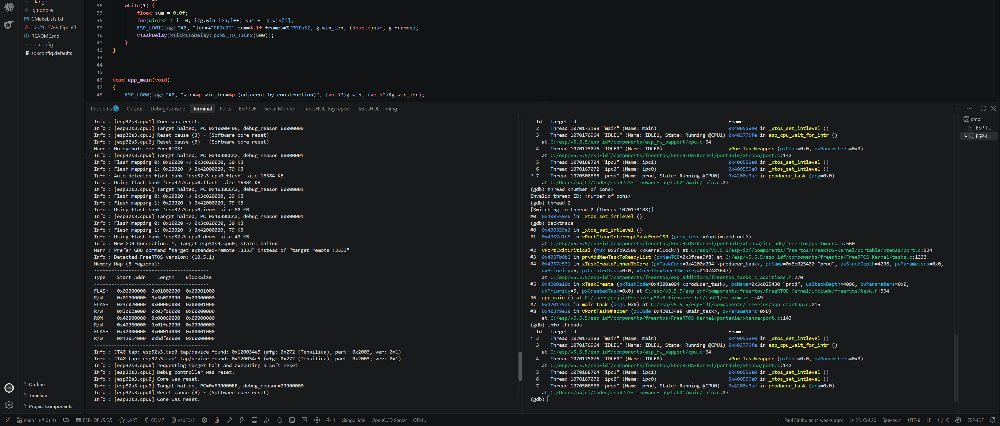
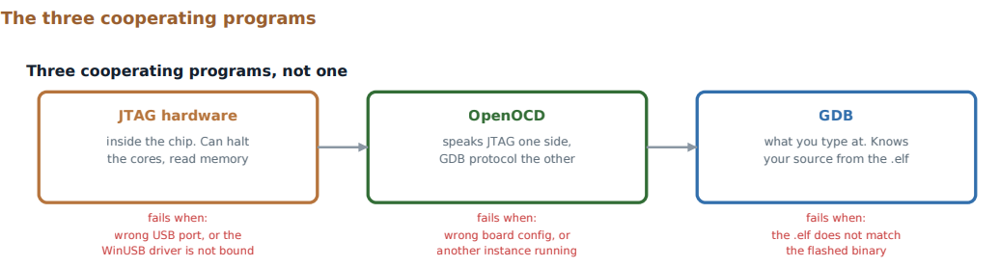
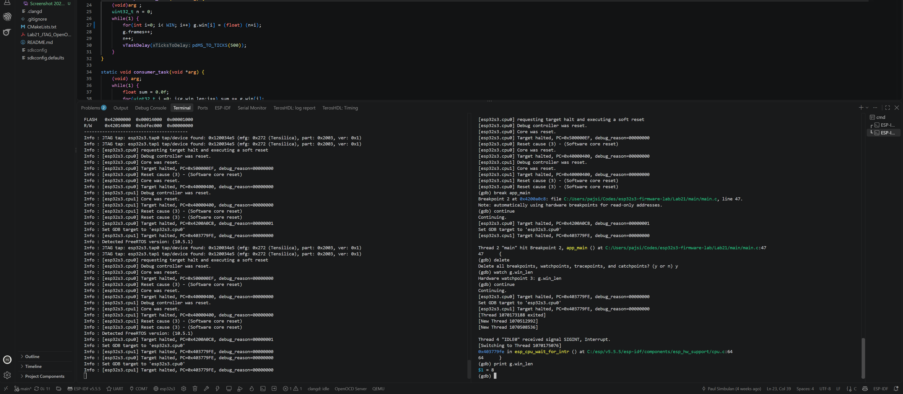

# Lab 21: Finding Memory Corruption with a Hardware Watchpoint

A bug that only shows up as a wrong number: a loop bound that changes on its own. No crash, no stack trace. I found the line that writes it with a hardware watchpoint over JTAG, using only the S3's built-in USB.


*GDB stops in `prod` at main.c:27 the moment `g.win_len` changes. The old value was 8 and the new one is `0x41000000`, which is the float 8.0.*

| Root cause: the same address | Who was running |
|---|---|
| ![&g.win[8] and &g.win_len are both 0x3fc92800](screenshots/lab21_proof_same_address_root_cause.png) |  |

| The debug chain | Fix verified |
|---|---|
|  |  |

| | |
|---|---|
| **Board** | ESP32-S3 N16R8, built-in USB-JTAG, no external probe |
| **Tools** | OpenOCD, `xtensa-esp32s3-elf-gdb`, VS Code terminal |
| **Bug** | Producer writes `win[0..WIN]`, one past the end, into `win_len` |
| **Key commands** | `watch g.win_len`, `p &g.win[8]`, `p &g.win_len`, `info threads`, `thread 2`, `bt` |

## How it works

- **Planted on purpose, kept honest.** `win_len` sits directly after `win[8]`, and a `_Static_assert` on `offsetof` guarantees that layout so the overflow always lands on it.
- **A watchpoint is hardware.** The CPU's debug unit compares every store address with the watched one and halts on a match. Zero slowdown, and it catches the writer, not the later victim.
- **The proof is two addresses.** `&g.win[8]` and `&g.win_len` both print `0x3fc92800 <g+32>`. Index 8 of an 8-element array is the next field.
- **The value tells the story.** `0x41000000` is 8.0f, a float written into an integer.
- **RTOS-aware GDB.** `info threads` lists FreeRTOS tasks. Thread 2's backtrace showed `main` paused inside `xTaskCreate` for `prod`. Since `prod` has a higher priority than `main`, it ran first and corrupted the struct before `cons` even existed.

## Coming from the TM4C123

Keil gave breakpoints and a register view. Watchpoints existed but I never needed one, because a single super loop rarely has a writer you cannot find by reading the code. With tasks, you can.

## Results

| | Before | After |
|---|---|---|
| Loop | `i <= WIN` | `i < WIN` |
| `win_len` | Becomes `0x41000000` | Stays 8 |
| Consumer | Reads past the array, sums garbage | Correct sums |

## Build and debug

```powershell
idf.py build flash
openocd -f board/esp32s3-builtin.cfg
xtensa-esp32s3-elf-gdb build/lab21.elf -ex "target extended-remote :3333"
```

In GDB: `mon reset halt`, `break app_main`, `continue`, `watch g.win_len`, `continue`.
