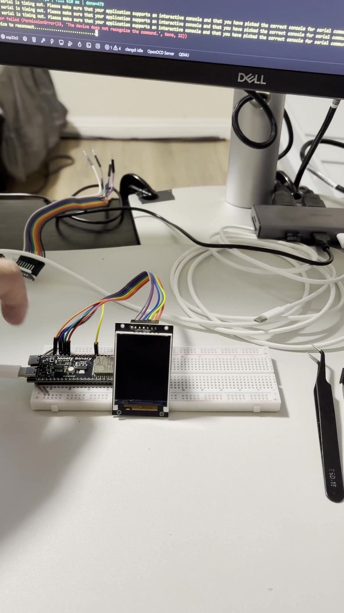
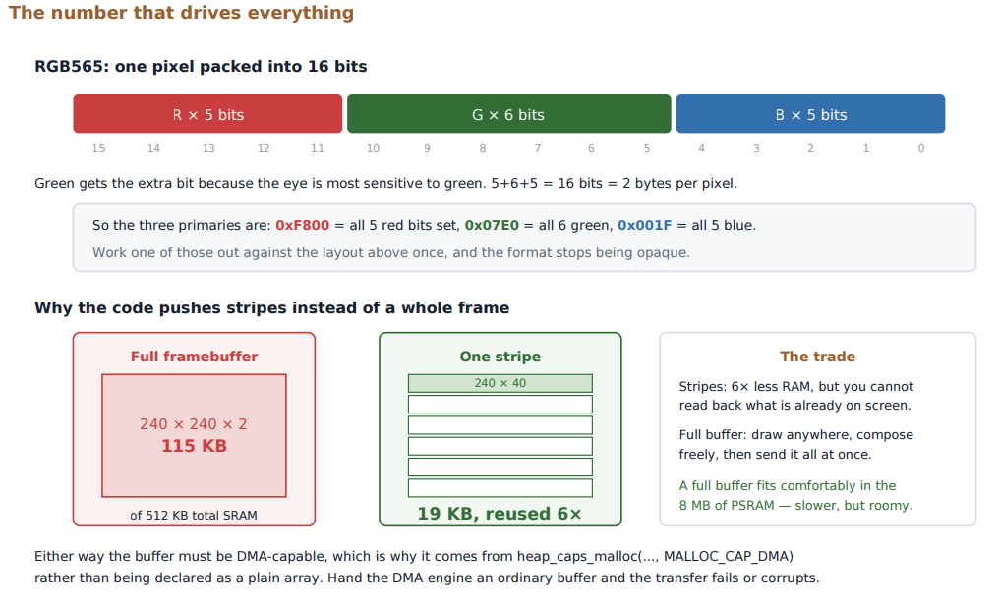
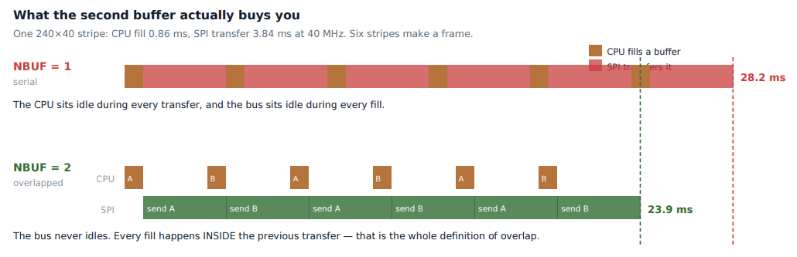
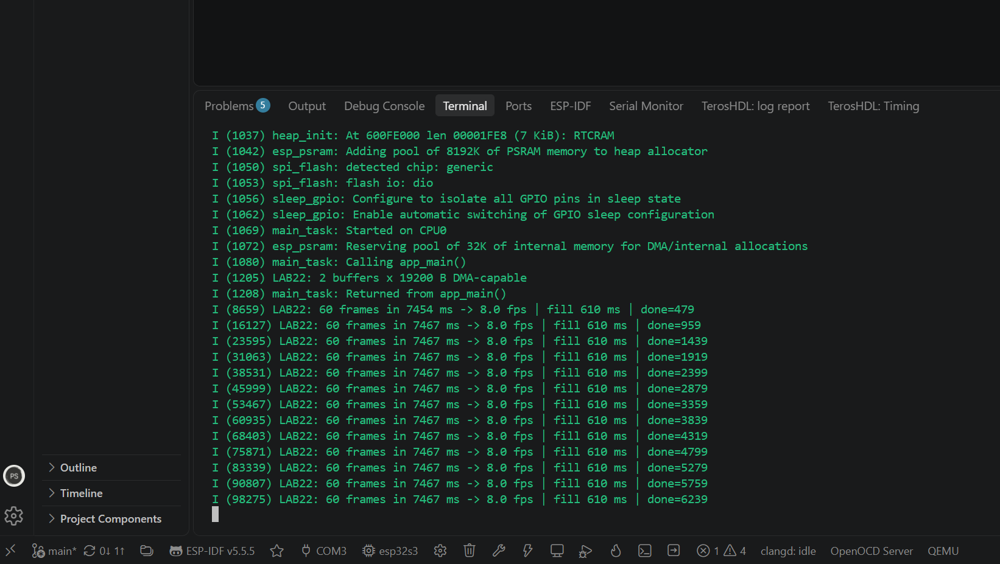

# Lab 22: SPI Display with DMA and Ping-Pong Buffers

Driving a 240x320 TFT over SPI with DMA. One buffer is filled while the other is on the wire, so the CPU and the bus work at the same time. Then I measured the frame rate and checked it against the math.

<a href="screenshots/lab22_demo_tft_image_over_spi_dma.mp4"></a>

*Click to play. An image converted to RGB565 on the laptop, stored in flash, and pushed to the display in stripes.*

| RGB565 and stripes | Ping-pong buffers |
|---|---|
|  |  |



*60 frames: fill time 610 ms in total, which is about 10 ms per frame. The rest of the frame time is the SPI wire itself.*

| | |
|---|---|
| **Board** | ESP32-S3 N16R8 |
| **Display** | ST7789V 2.0" 240x320, RGB565 |
| **Pins** | SCLK IO12, MOSI IO11, CS IO10, DC IO14, RST IO15, BL to 3V3 |
| **SPI clock** | 10 MHz |
| **Key APIs** | `spi_bus_initialize()` with `SPI_DMA_CH_AUTO`, `esp_lcd_new_panel_io_spi()`, `esp_lcd_new_panel_st7789()`, `esp_lcd_panel_draw_bitmap()`, `on_color_trans_done` callback, `heap_caps_malloc(MALLOC_CAP_DMA)` |
| **Host tool** | `convert.py` turns `cat.jpg` into a 240x320 RGB565 C array (`cat_img.h`) |

## How it works

- **The wire limit first.** 240 x 320 x 2 bytes = 153,600 bytes = 1.23 Mbit per frame. At 10 MHz that is 8.1 fps at most. The board measured 8.0, so the firmware is not the bottleneck.
- **Stripes, not a full frame.** A whole frame is 150 KB. The display is drawn in 40-row stripes (19,200 bytes each) from two DMA-capable buffers in internal RAM.
- **Ping-pong.** While DMA sends stripe A, the CPU copies the next stripe of the image into buffer B. Then they swap. A counting semaphore tracks free buffers, and the `on_color_trans_done` callback gives one back when a transfer finishes. The fill time hides under the transfer time.
- **D/C is a GPIO.** The ST7789 uses one pin to tell commands from pixel data. The `esp_lcd` panel IO driver drives it (`dc_gpio_num`) for each command and data transfer.
- **Byte order.** RGB565 goes out high byte first, so `convert.py` byte-swaps each pixel before writing the array. Getting it backwards gives wrong but stable colors, which is a useful clue.

## Results

| Metric | Value |
|---|---|
| Frame rate | 8.0 fps, matches the 10 MHz wire limit |
| CPU fill time | 610 ms per 60 frames |
| Image | Photo shown correctly with right colors |

## What broke

- **White screen, nothing else.** The backlight was on but no command took. RST was on the wrong header pin (pin 9 instead of 8) because of a wrong pin table. With reset floating the controller never initialized. Lesson: check the header map against the board silkscreen, not a table.

## Build

```powershell
python convert.py     # reads cat.jpg, writes cat_img.h, move it into main/
idf.py build flash monitor
```
