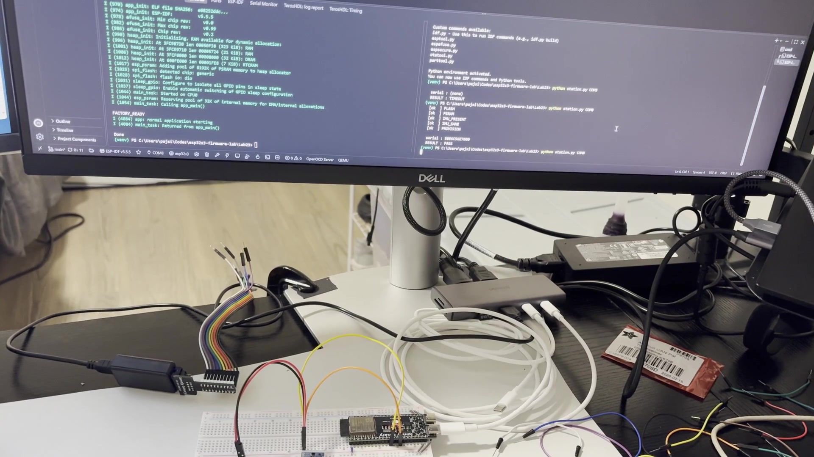
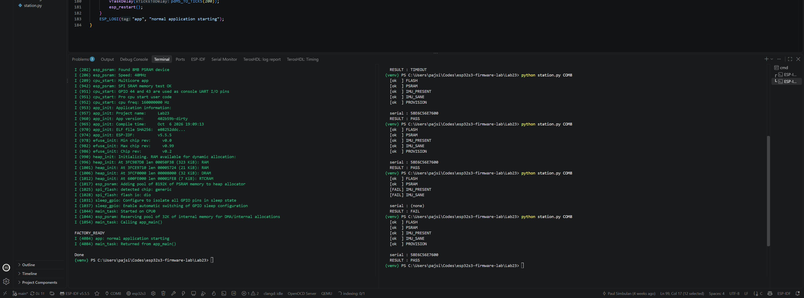
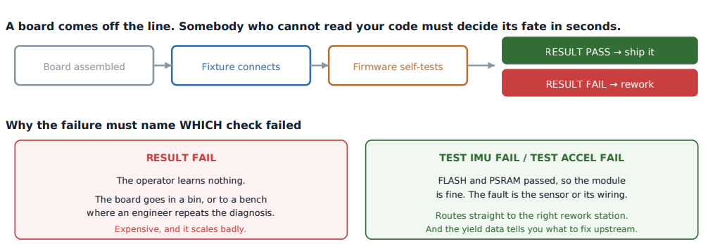
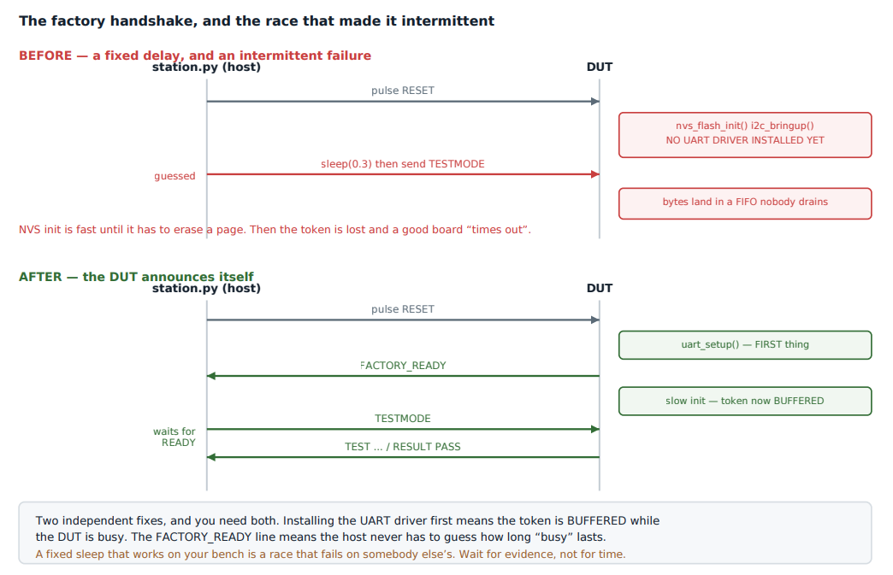

# Lab 23: Production Test Mode and a Factory Station

How boards get tested on a production line. At boot the firmware opens a short window and listens for a magic word. If the test station sends it, the board runs its self-tests, reports each one, and the station logs a PASS or FAIL with the board's serial number. If nobody asks, the board boots normally.

[](screenshots/lab23_demo_factory_test_pass_fail_pass.mp4)

*Click to play. Same board three times: PASS, FAIL after pulling the IMU's SDA wire, then PASS after putting it back.*



| Factory flow | The handshake race |
|---|---|
|  |  |

| | |
|---|---|
| **Board** | ESP32-S3 N16R8 with the MPU-6500 from earlier labs |
| **Handshake** | Board prints `FACTORY_READY`, station sends `TESTMODE` within 3000 ms |
| **Tests** | `FLASH`, `PSRAM`, `IMU_PRESENT`, `IMU_SANE`, `PROVISION` |
| **Identity** | Serial number from the factory MAC, `58E6C56E7600` on this board |
| **Station** | `station.py` (pyserial), appends to `factory_log.csv`, exit code 0 or 1 |

## How it works

- **A test window, not a test build.** The same firmware ships and tests. Production never has to flash a special image.
- **Each check prints one line.** `TEST IMU_PRESENT PASS`, then a final `RESULT PASS`. Easy for a script to parse and easy for a person to read.
- **The station decides.** It records timestamp, serial, verdict and the names of failing tests. A run that never reaches `RESULT` is logged as `INCOMPLETE` and treated as a failure.
- **Sane, not just present.** `IMU_SANE` checks that the accelerometer reads about 1 g at rest. A sensor that answers but reads nonsense still fails.
- **Avoiding the race.** The UART driver is installed before `FACTORY_READY` is printed, so a fast station's `TESTMODE` lands in the buffer instead of being lost.

## Results

| Run | Verdict | Failing tests |
|---|---|---|
| 1 | PASS | none |
| 2, SDA pulled | FAIL | `IMU_PRESENT`, `IMU_SANE` |
| 3, SDA back | PASS | none |

## What broke

- **Every run timed out.** I was on COM3, which is the S3's native USB port and only carried the console output here. The station's `TESTMODE` never reached the UART. COM8, the USB-UART bridge, was the right port.

## Coming from the TM4C123

Never part of a class lab. On a real product every board goes through a station like this before it ships.

## Run

```powershell
idf.py build flash
python station.py COM8
```
