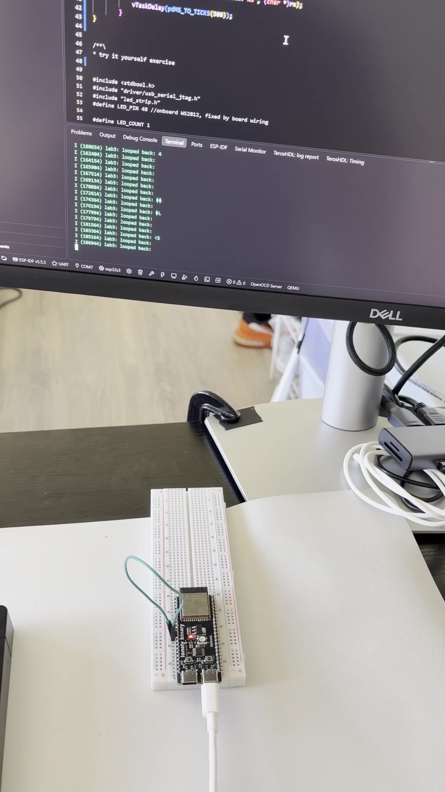
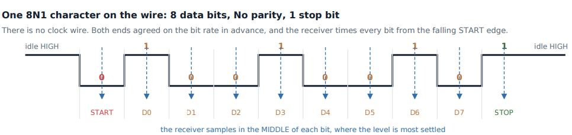

# Lab 3: UART, Loopback and a Serial Command Parser

Asynchronous serial from the wire up. Framing and baud error, the driver's RX ring buffer, a physical loopback that proves the peripheral before trusting it, and a line parser that handles bytes arriving one at a time.

<a href="screenshots/lab03_demo_uart_loopback_wire_pulled.mp4"></a>

*Click to play. GPIO17 is jumpered to GPIO18. Pulling the wire stops the looped-back data, and putting it back brings it back.*



| | |
|---|---|
| **Board** | ESP32-S3 N16R8 |
| **Peripherals** | UART1 (loopback), plus USB-Serial-JTAG and RMT in the parser exercise |
| **Pins** | GPIO17 TX, GPIO18 RX, one jumper between them |
| **Key APIs** | `uart_driver_install()`, `uart_param_config()`, `uart_set_pin()`, `uart_write_bytes()`, `uart_read_bytes()`, and in the parser `usb_serial_jtag_driver_install()`, `usb_serial_jtag_read_bytes()` |
| **Tools** | Logic analyzer at 4 MHz with the UART 115200 8N1 decoder |

## How it works

- **No clock wire.** Both ends agree on a bit rate and the receiver times every bit from the falling start edge, sampling in the middle of each bit. 8N1 is 10 bit times per byte, so 115200 baud moves 11520 bytes a second.
- **Baud error budget.** The receiver free runs after the start bit, so total timing error has to stay under about 2 percent across the frame.
- **The driver owns the RX ring buffer.** `uart_driver_install()` is called with a 1024 byte RX ring and a TX size of 0. An ISR drains the hardware RX FIFO into the ring, so bytes are not lost while my task is busy. With no TX ring, `uart_write_bytes()` waits until the bytes are in the hardware FIFO before it returns. The loop sends `ping\r\n`, reads back with a 50 ms timeout, logs it and sleeps 500 ms.
- **Prove the bus alone first.** The loopback answers "is my peripheral set up right" with no second device in the picture. The same habit shows up again in Lab 9 (SPI) and Lab 17 (CAN).
- **The parser.** This is the try-it-yourself exercise, kept in a commented-out block at the bottom of `main.c` (swap it in for the loopback `app_main()` to run it). It reads the USB-Serial-JTAG console, not UART1. Keystrokes arrive one at a time, so it keeps a buffer and an index that survive across reads, and dispatches on `\r` or `\n`. A terminal sending `\r\n` fires twice, so empty lines are ignored. Lines longer than `CMD_LINE_MAX` (64) are dropped with a warning. Commands: `led on`, `led off`, `led status`.

## Results

| Check | Result |
|---|---|
| Loopback | `ping` comes back byte for byte with the jumper in, nothing without it |
| Wire framing | Analyzer decodes the ASCII on GPIO17 at 115200 8N1 |
| Fragmented input | Characters typed one at a time assemble into one command |
| Commands | `led on` lights the LED green, `led off` clears it, `led status` reports the stored state |

## What broke

- **Junk bytes and empty lines from a loose jumper.** Lines like `looped back:` with nothing after them were `0x00` bytes from bad contact. A firmly seated jumper fixed it, and the clean run prints `looped back: ping` every 550 ms (500 ms delay plus the 50 ms read timeout).
- **The monitor kept dropping with `ClearCommError`.** That was the USB link re-enumerating, not my code. The board kept running the whole time, which the log timestamps prove.
- **`LINE_MAX` collided with a system header.** Renamed to `CMD_LINE_MAX`. Good argument for prefixing project macros.
- **A null handle crash that looked like a driver bug.** My `led_init()` never called `led_strip_new_rmt_device()`, so the handle was null.
- **`led_strip` v2.5.5 lacks fields the newer docs show.** Leaving them out works because unnamed fields default to zero. Check the version you actually resolved, not the docs you found.

## Build

```powershell
idf.py build flash monitor
```

Jumper GPIO17 to GPIO18 (header pins 10 and 11 on this board).
