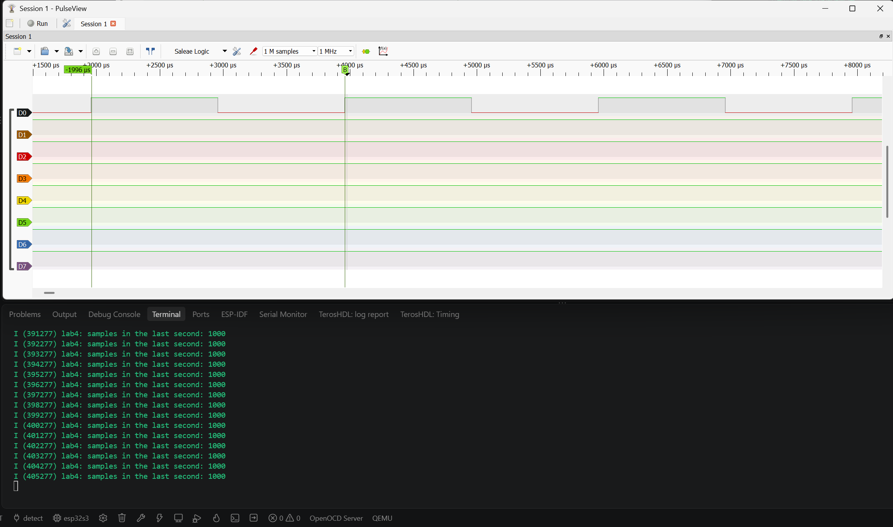
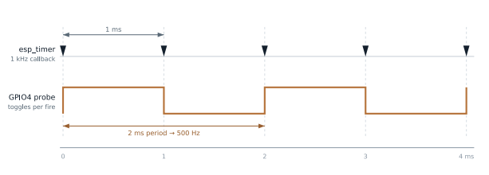
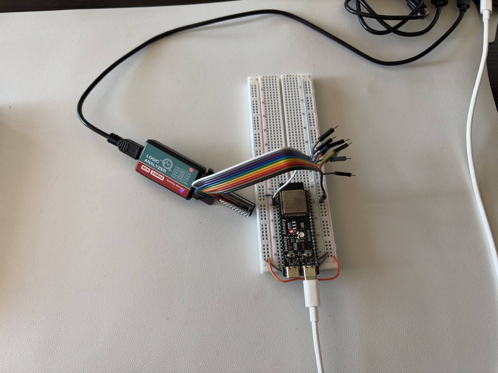

# Lab 4: Hardware Timers and Fixed-Rate Sampling

A 1 kHz event generated by a hardware timer instead of a delay loop, handed safely across the interrupt boundary, and then measured on a logic analyzer instead of trusting the firmware's own count.



*The firmware counts 1000 callbacks every second (bottom). The analyzer on GPIO4 shows a 2 ms period, which is exactly right for a pin that toggles once per 1 kHz callback.*

| Concept | Bench |
|---|---|
|  |  |

| | |
|---|---|
| **Board** | ESP32-S3 N16R8 |
| **Peripherals** | `esp_timer`, GPIO |
| **Pins** | GPIO4 as a probe pin |
| **Key APIs** | `esp_timer_create()`, `esp_timer_start_periodic()`, `esp_timer_get_time()`, `gpio_set_level()` |
| **Tools** | 8 channel 24 MHz logic analyzer, CH0 on GPIO4, 1 MHz sample rate, PulseView |

## How it works

- **The timer is free running.** `esp_timer` sits on a 64-bit counter that has been counting since boot. Each next deadline is computed from the last target, not from when the callback finished, so the period does not stretch.
- **The period is in microseconds.** 1 kHz is `1000`, which reads a lot like milliseconds.
- **Why not the scheduler.** At a 100 Hz tick, 1 kHz cannot even be expressed with `vTaskDelay`. A hardware deadline only has interrupt latency left as error.
- **`volatile` is not atomic.** The counter is `volatile` so the reporting task reloads it from memory every time. But `samples++` is still read, add, write, and can be interrupted between steps. Fine for one writer, but the general fix is an atomic, a critical section or a queue. That is the whole answer to a very common interview question.
- **The wire shows half the callback rate.** One toggle per callback means one full cycle takes two callbacks. 1 kHz in, 500 Hz on the pin.

## Measuring it

At 1 MHz the analyzer timestamps every edge to 1 µs, which is a 0.1 percent floor against a 1 ms interval. Nyquist is not the right rule for a logic analyzer, since it is thresholding edges, not rebuilding an analog wave. The rule I use: 10x the signal to see it, 100x to measure jitter.

## Results

| Check | Result |
|---|---|
| Callback rate | Log reports 1000 per second, sustained |
| Period on the wire | 2 ms square wave on GPIO4, about 500 Hz by cursor |
| Jitter | Edges stable within the 1 µs resolution |

## What broke

- **A checksum mismatch that was not bad flash.** The chip was running Lab 3 while I monitored from the Lab 4 folder. That pushed me to explicit `idf.py -p COMx build flash monitor` for every lab.
- **esptool could not open the COM port.** An old monitor still held it. Windows does not tell you who owns a port.
- **The analyzer showed up as an unknown device.** Zadig had to bind WinUSB to it before PulseView's `fx2lafw` driver could see it. It only supports sample rates that divide 48 MHz evenly.
- **Flat traces on every channel.** No common ground between the analyzer and the board. Almost always the first thing to check.

## Build

```powershell
idf.py build flash monitor
```
