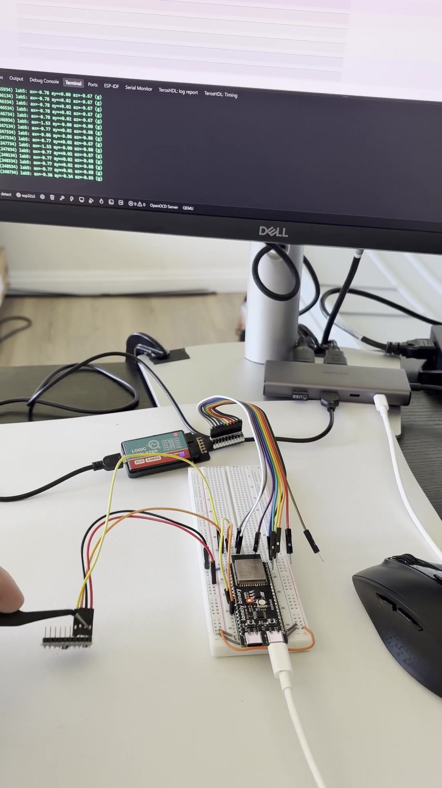
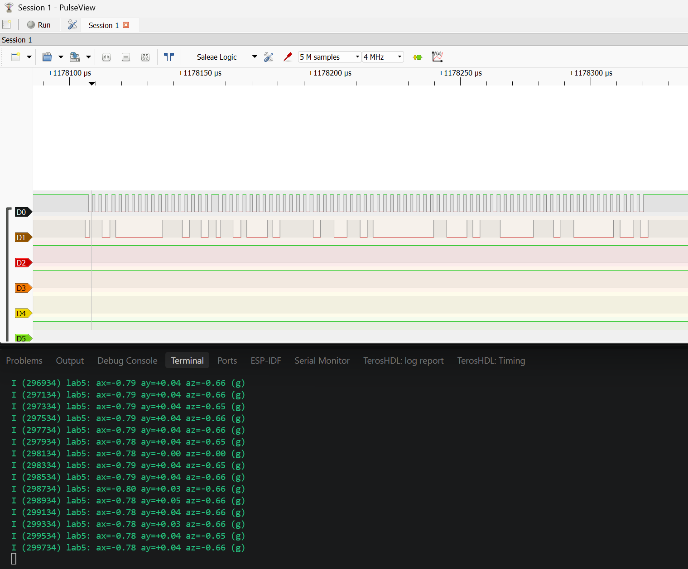
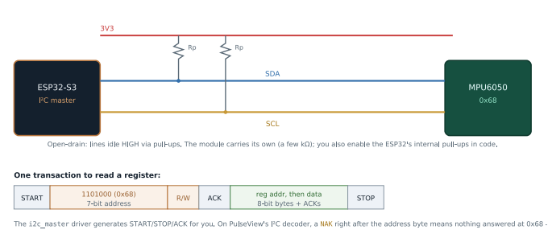

# Lab 5: I2C and IMU Bring-Up

Bringing up a real sensor from its datasheet. Reading the device ID, waking the part, setting its range, and turning raw big-endian register pairs into signed acceleration in g. Written against the register map, not a sensor library.

<a href="screenshots/lab05_demo_mpu_tilt_with_i2c_capture.mp4"></a>

*Click to play. Tilting the IMU changes the ax, ay, az values in the log, with the logic analyzer tapped onto SDA and SCL.*





| | |
|---|---|
| **Board** | ESP32-S3 N16R8 |
| **Peripheral** | I2C master, the v5.x `driver/i2c_master.h` API |
| **Pins** | GPIO8 SDA, GPIO9 SCL |
| **Sensor** | TDK InvenSense MPU-6500 6-axis IMU at bus address `0x68` |
| **Key APIs** | `i2c_new_master_bus()`, `i2c_master_bus_add_device()`, `i2c_master_transmit_receive()` |
| **Tools** | Logic analyzer, SDA and SCL at 4 MHz, PulseView I2C decoder |

## How it works

- **The address travels on the wire.** `0x68` is a 7-bit number clocked out on SDA right after the start condition. Every device on the two wires compares it with its own and only the match answers. Compare with SPI in Lab 9, which uses a chip select wire per device instead.
- **Bus handle and device handle.** ESP-IDF v5 splits the controller (pins, port) from each device (address, speed). `i2c_master_transmit_receive()` does the write, repeated start, read pattern every sensor register read uses.
- **Bring-up order:**
  1. Read `WHO_AM_I` (register `0x75`) to prove reads work.
  2. Clear the sleep bit in `PWR_MGMT_1` (`0x6B`). Skip this and you get steady zeros that look like data.
  3. Set the accelerometer range (`0x1C`).
  4. Burst read 6 bytes from `0x3B` for all three axes in one transaction.
- **Rebuilding the numbers.** Each axis is a big-endian signed 16-bit value, so it is `(int16_t)((hi << 8) | lo)`, then divide by the LSB per g for the range. Sanity check: a still board reads about 1 g on the vertical axis.

## Results

| Check | Result |
|---|---|
| Device answers | ACK at `0x68` |
| Reads work | `WHO_AM_I` returns `0x70` every time |
| Part is awake | Values move with the board |
| Bus speed | SCL measured about 399 kHz against a 400 kHz setting |
| Values are physical | Still board reads about 0.99 g on the vertical axis |
| Sign handling | Flipping the board flips the sign cleanly |

## What broke

- **`WHO_AM_I` returned `0x70`, not the `0x68` every tutorial expects.** The breakout carries an **MPU-6500**, not an MPU-6050. `0x70` is its real ID, and the bus address is a different number entirely. Every register used here is the same across the family. Reading a consistent unexpected value meant the wiring was right, and the TDK register map confirmed it.
- **Every axis read a constant 1.88 g.** The reads were failing and my code ignored the return value, so it printed leftover stack bytes. The wires were on the wrong header pins. On this board the silkscreen IO number and the header position differ (IO8 is header pin 12, IO9 is pin 15). Checking `esp_err_t` on every read turned a silent failure into a clear NACK.
- **The bus ran at 100 kHz while the code said 400 kHz.** It did not show up here. It showed up in Lab 7 as a slow sample rate.

## Build

```powershell
idf.py build flash monitor
```

MPU VCC to 3V3, GND to GND, SDA to IO8, SCL to IO9. Leave XDA, XCL, AD0, INT, NCS and FSYNC unconnected.
