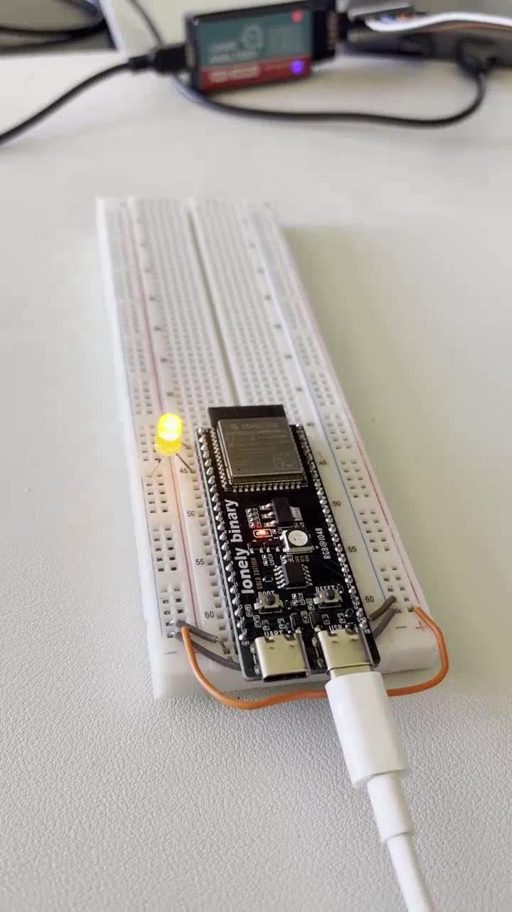
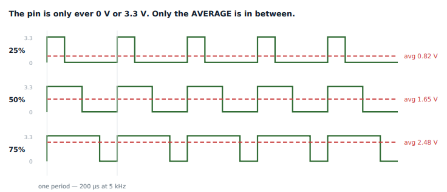

# Lab 6: PWM with the LEDC Peripheral

Hardware PWM. Why duty resolution and frequency trade against each other as plain arithmetic, why a duty change needs a latch, and stepping the duty from a task to make an LED breathe.

[](screenshots/lab06_demo_led_pwm_fade.mp4)

*Click to play. An LED on GPIO4 breathing up and down, driven by a task that steps the LEDC duty every 15 ms.*



| | |
|---|---|
| **Board** | ESP32-S3 N16R8 |
| **Peripheral** | LEDC (LED Control) |
| **Pins** | GPIO4 output |
| **Settings** | 5 kHz, 13-bit duty resolution |
| **Key APIs** | `ledc_timer_config()`, `ledc_channel_config()`, `ledc_set_duty()`, `ledc_update_duty()` |

## How it works

- **Resolution and frequency are one equation.** LEDC counts from 0 to `2^bits - 1`, so `f_pwm = f_clk / 2^bits`. At an 80 MHz clock, 13 bits tops out near 9.7 kHz, so 5 kHz fits. Asking for 13 bits at 100 kHz does not, and the driver refuses.
- **What matters depends on the load.** For an LED, more resolution matters, since coarse steps show as banding when dim. For a motor, frequency matters, so it sits above hearing range.
- **The duty change needs two calls.** `ledc_set_duty()` writes a shadow register and `ledc_update_duty()` latches it at the next period boundary. That latch exists so a change never lands mid-pulse. Forgetting the second call is the classic bug: no error, and nothing changes.
- **The fade loop.** The task walks the duty from 0 to 8191 and back in steps of 32, with a 15 ms delay per step, so one full ramp takes about 3.8 s each way. The LEDC hardware holds the waveform steady between updates. This PWM output is what the controller in Lab 18 would drive.

## Results

| Check | Result |
|---|---|
| Frequency | Period on GPIO4 matched 5 kHz |
| Duty | High time matched 25, 50 and 75 percent commands |
| Latch | Removing `ledc_update_duty()` left the output unchanged |
| Fade | Smooth ramp up and down with no visible banding |

## What broke

- **A duty change that did nothing.** `ledc_set_duty()` returned `ESP_OK` and the pin did not change. The value was never latched. Two minutes in the API docs, versus an hour if I had assumed the wiring was wrong.
- **Resolution rejected at a high frequency.** It reads like a driver limit, but it is just the division above not fitting.

## Build

```powershell
idf.py build flash monitor
```

LED (with a resistor) from GPIO4 to GND.
