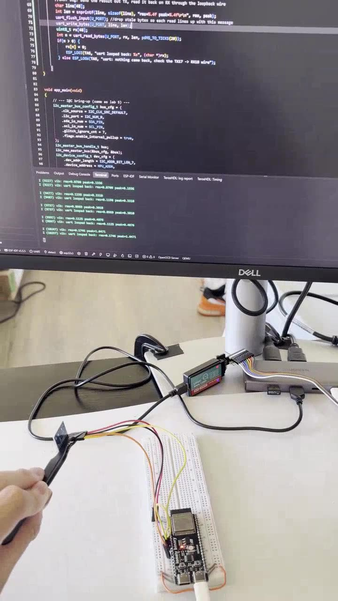
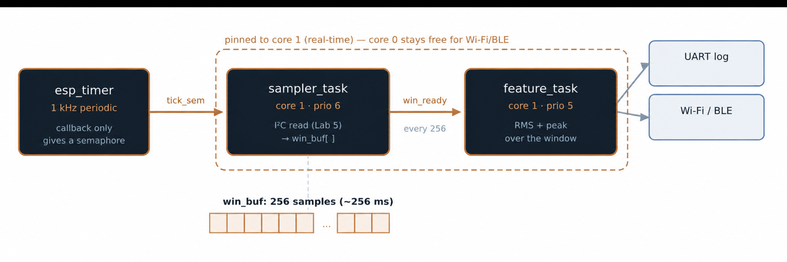

# Lab 7: The Sensor Pipeline (Phase 1 Capstone)

Labs 2 through 5 put together into one sensor node design. A hardware timer paces sampling, a sampler task reads the IMU at a fixed rate into a window, a feature task computes RMS and peak per window, and the result goes out a UART. Acquire, process, report.

[](screenshots/lab07_demo_vibration_rms_with_uart_log.mp4)

*Click to play. Shaking the IMU makes RMS and peak jump. Each result is also sent out UART1 and read back through a loopback wire.*



| | |
|---|---|
| **Board** | ESP32-S3 N16R8 |
| **Peripherals** | `esp_timer`, I2C master, UART1, FreeRTOS semaphores |
| **Pins** | GPIO8/9 I2C to the MPU-6500, GPIO17 TX to GPIO18 RX loopback for the UART log |
| **Rates** | 1 kHz sampling, 256 sample window, about 3.9 feature results per second |
| **Key APIs** | `xSemaphoreCreateBinary()`, `xSemaphoreGive()` from the timer callback, `xSemaphoreTake()`, `xTaskCreatePinnedToCore()`, `uart_write_bytes()` |

## How it works

```
esp_timer (1 kHz)
   |  gives tick_sem
   v
sampler_task   I2C burst read, scale to g, store magnitude in win_buf[]
   |  gives win_ready every 256 samples
   v
feature_task   RMS and peak over the window, log it, send it out UART1
```

- **The timer only signals.** No I2C, no math, no logging in the callback. An I2C read takes hundreds of microseconds and blocks, so it belongs in a task.
- **Fixed rate path vs variable cost path.** The sampler owns the bus and is paced by the timer. The feature task can take as long as it likes without moving the sample instants. That split is the main idea and it applies to almost every real-time data system.
- **Semaphores used as signals, not locks.** The timer gives `tick_sem` and never takes it. The sampler takes it and never gives it. Same primitive as a lock, opposite meaning. Lab 16 shows when you want a real lock instead.
- **Core pinning.** Both tasks are pinned to core 1 so Wi-Fi and BLE work on core 0 cannot preempt the real-time path.
- **UART log stage.** Each result is written to UART1 and read back through a jumper, with a flush before each write so every read lines up with the message just sent.

## Known limitation, left on purpose

There is one window buffer shared by both tasks. Nothing stops the sampler from overwriting it while the feature task reads. At these rates the math finishes well inside one window, so it does not show, but it is a real race. Lab 22 fixes the same problem properly with two buffers and an ownership rule.

## Coming from the TM4C123

The ECE 425 version would be one ISR that reads the sensor, updates a global and sets a flag for the main loop. It works until any stage takes variable time, because there is nowhere to defer the work to. Here there is.

## Results

| Check | Result |
|---|---|
| Sample rate | 1 kHz, checked by toggling a pin around the sampler and capturing it |
| Window rate | About 3.9 feature lines per second (1000 / 256) |
| Cost per sample | About 310 µs, jitter under 20 µs |
| Values | Small RMS at rest, big jump when the board is shaken |
| UART log | Each result comes back intact through the loopback |

## What broke

- **Windows arrived at 1 Hz instead of 4 Hz.** The best debug story in Phase 1.
  - **Saw:** about 1 feature line a second instead of 4. Values looked fine, just slow.
  - **Tried:** timer period was right. A counter in the sampler showed only about 250 samples a second, so ticks were being missed. Then I toggled GPIO4 high at the top of the sampler and low at the bottom and captured it.
  - **Found:** each pass took about 3.9 ms, not 0.3 ms. SCL was set to 100 kHz instead of 400 kHz and reads were hitting the timeout. One config value.
  - **Lesson:** I assumed the rate instead of measuring it. A pin toggle around a code block is the cheapest profiler on a microcontroller.
- **UART log showed junk, then each line one message behind.** First a loose jumper (zero bytes). Then a stale byte left in the RX buffer made every fixed-length read start one byte late, so each line showed the previous window. `uart_flush_input()` before each write fixed it.
- **Loopback jumper on the wrong pins.** "Below 9" meant two different things depending on whether you count IO labels or header positions. IO17 and IO18 are header pins 10 and 11.

## Build

```powershell
idf.py build flash monitor
```

MPU on IO8/IO9 as in Lab 5, plus a jumper from IO17 to IO18.
