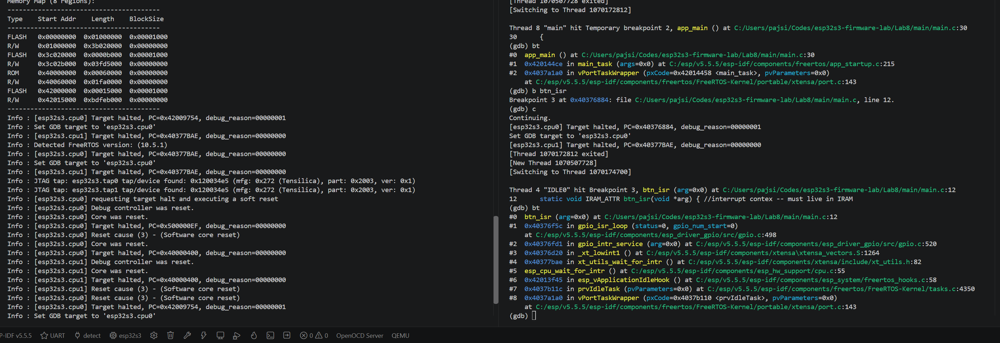
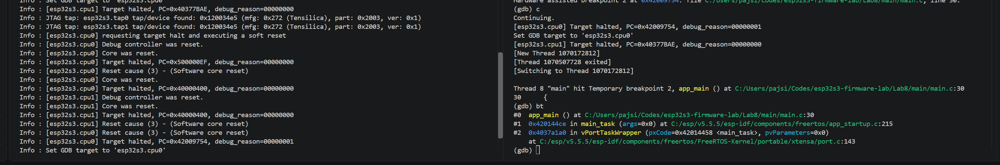
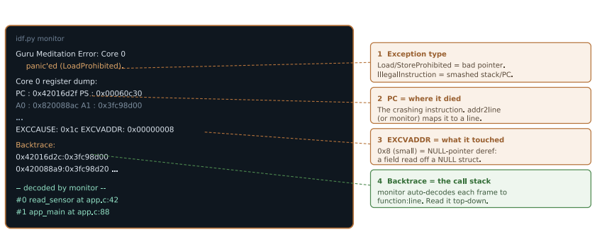

# Lab 8: GPIO Interrupts and ISR-Safe Code

An edge interrupt on a real button, an ISR that only posts an event, and a worker task that does the actual work. The "keep ISRs tiny" pattern, plus the memory rules that make an ISR safe to run at all. I also used this lab's firmware for the debugging clinic: halting it live over the built-in JTAG and breaking inside the interrupt handler.



*GDB halted inside `btn_isr` the moment BOOT was pressed. Read the backtrace bottom up: idle task asleep, level 1 interrupt vector, shared GPIO ISR service, then my handler with `arg = 0` for GPIO0.*

| Halt at `app_main` | Reading a crash dump |
|---|---|
|  |  |

| | |
|---|---|
| **Board** | ESP32-S3 N16R8 |
| **Peripherals** | GPIO interrupt, FreeRTOS queue, built-in USB-Serial-JTAG |
| **Pins** | GPIO0 BOOT button, falling edge |
| **Key APIs** | `gpio_install_isr_service()`, `gpio_isr_handler_add()`, `xQueueCreate()`, `xQueueSendFromISR()`, `portYIELD_FROM_ISR()`, `IRAM_ATTR` |
| **Tools** | OpenOCD `board/esp32s3-builtin.cfg`, `xtensa-esp32s3-elf-gdb`, Zadig (WinUSB on interface 2) |

## How it works

- **Two halves.** The ISR takes the pin number from its argument, pushes it into a queue, asks for a context switch and returns. Debounce, logging and the response happen in a normal task. Linux calls this top half and bottom half.
- **`FromISR` versions.** `xQueueSend` can block, and you cannot block in an interrupt. `xQueueSendFromISR` never blocks and reports whether it woke a higher priority task. `portYIELD_FROM_ISR()` then switches straight to that task instead of waiting up to a full tick.
- **`IRAM_ATTR`.** Code normally runs from flash through a cache. A miss in an ISR stalls, and if the flash is busy being written it cannot be fetched at all. `IRAM_ATTR` puts the handler in internal RAM. The debugger proves it: `btn_isr` sits at `0x40376884` in IRAM while `app_main` is up at `0x42...` in flash.
- **The catch.** `IRAM_ATTR` covers the function, not what it touches. String literals and called functions can still live in flash, which is why `ESP_LOGI` in an ISR is the classic mistake.

## Debugging clinic: halting it live

1. Bound WinUSB to **USB JTAG/serial debug unit (Interface 2)** in Zadig. Interface 0 is the COM port and must be left alone.
2. `openocd -f board/esp32s3-builtin.cfg` found both cores and opened a GDB server on port 3333.
3. In a second terminal: `xtensa-esp32s3-elf-gdb build/Lab8.elf`, then `target remote :3333`, `mon reset halt`, `thb app_main`, `c`.
4. `bt` showed `app_main` called from ESP-IDF's `main_task`. Then `b btn_isr`, `c`, press BOOT, `bt` again for the shot above.

Pressing Enter on an empty `(gdb)` line repeats the last command, which once sent me straight past `app_main` into the idle task. That stop was useful too: the idle task sitting in `esp_cpu_wait_for_intr()` is exactly what a sleeping CPU looks like.

## Results

| Check | Result |
|---|---|
| Interrupt fires | One `button press handled (gpio 0)` per press |
| ISR stays minimal | No logging, no delays, no blocking calls inside |
| Queue decouples | The worker's 20 ms debounce does not affect interrupt latency |
| JTAG attach | OpenOCD sees both cores, GDB halts at `app_main` |
| Live ISR break | GDB stops inside `btn_isr` on a real press |

## What broke

- **The interrupt was armed before its handler existed.** `gpio_config()` with an interrupt type arms it right away, and I registered the handler after. A finger cannot press that fast, which is what makes it dangerous. The safe order is configure with interrupts off, register, then enable. The lab code still has the original order.
- **Held presses repeat.** The fixed debounce delay assumes the button is released. Fine for the lab, documented rather than hidden.
- **Events exactly 20 ms apart.** Suspiciously equal to my own debounce delay, not a property of the button. Following that to a measurement instead of a guess is the habit this whole series is about.
- **Zadig showed an empty list.** It hides devices that already have a driver. Options, List All Devices.

## Build

```powershell
idf.py build flash monitor
# debugging, two terminals:
openocd -f board/esp32s3-builtin.cfg
xtensa-esp32s3-elf-gdb build/Lab8.elf
```
