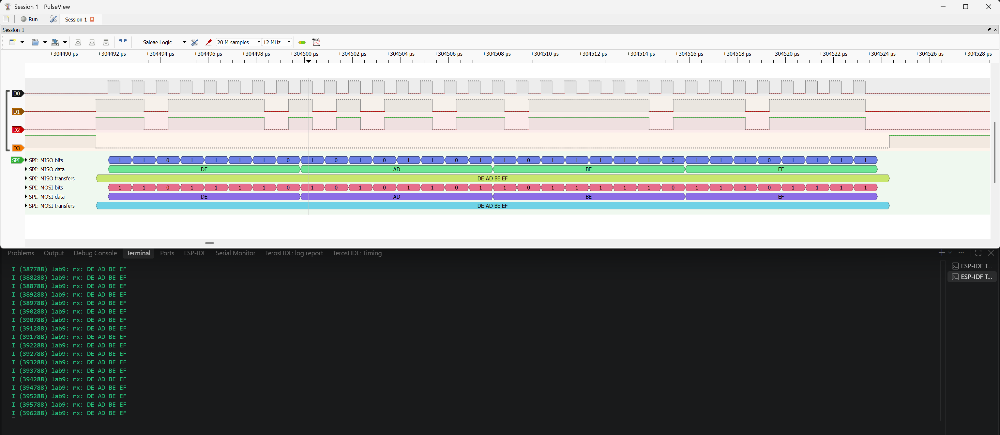
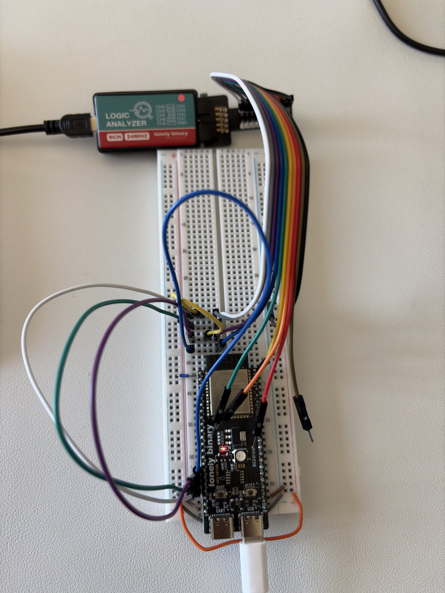
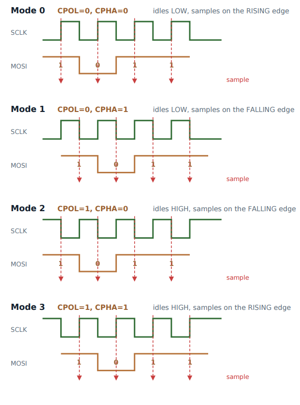
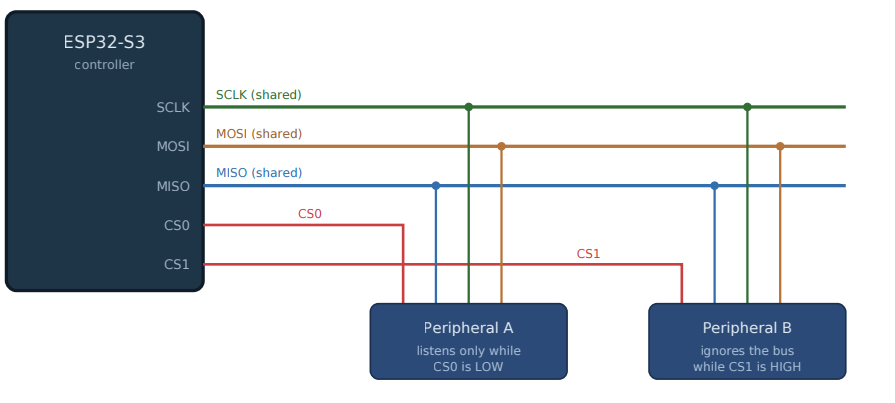
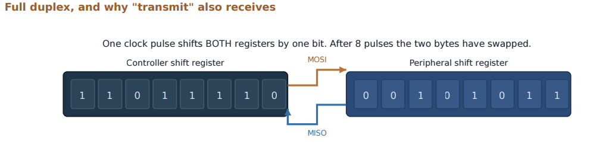

# Lab 9: SPI Master and Loopback

The other serial bus. Full duplex framing, clock polarity and phase, chip select as physical addressing, and DMA-backed transfers, proven with a MOSI to MISO jumper and a 4-channel logic analyzer capture.



*PulseView decodes `DE AD BE EF` on MOSI and the same bytes coming back on MISO in the same clock burst. The serial monitor prints `rx: DE AD BE EF` every 500 ms.*

| Bench | SPI modes |
|---|---|
|  |  |

| Shared bus, one CS per device | Full duplex |
|---|---|
|  |  |

| | |
|---|---|
| **Board** | ESP32-S3 N16R8, SPI2_HOST |
| **Pins** | GPIO10 CS, GPIO11 MOSI, GPIO12 SCLK, GPIO13 MISO |
| **Test** | MOSI jumpered to MISO, sending `DE AD BE EF` at 1 MHz, mode 0 |
| **Key APIs** | `spi_bus_initialize()`, `spi_bus_add_device()`, `spi_device_transmit()`, `spi_transaction_t` |
| **Tools** | Logic analyzer, 4 channels at 12 MHz, PulseView SPI decoder in mode 0 |

## How it works

- **CPOL and CPHA both describe the clock.** CPOL is the idle level. CPHA is first edge or second edge, which is a better way to read it than rising or falling, since the direction depends on CPOL. Mode 0 is what most parts use.
- **Full duplex, always.** Every clock shifts a bit out on MOSI and a bit in on MISO at the same time. There are no reads or writes, only transfers, which is why dummy bytes exist.
- **Length is in bits.** `t.length = 8 * sizeof(tx)`. A classic trap.
- **Parameters that read as one thing and mean another.** `max_transfer_sz` is bytes. `queue_size` is how many transactions can wait, not a buffer size. `SPI_DMA_CH_AUTO` lets the DMA engine move the bytes.
- **SPI vs I2C, the actual interview question.** SPI has no address and no ACK. A CS wire picks the device and the master has no idea if anyone listened. I2C uses an address on the wire and gets an ACK per byte. SPI trades wires for speed and simplicity.

## Results

| Check | Result |
|---|---|
| Loopback | `rx: DE AD BE EF` every 500 ms with the jumper seated |
| It is really the jumper | Without it, MISO floats and reads `FF FF FF FF` or `00 00 00 00` |
| Wire matches config | Decoder shows CS low, 32 clocks, and the same 4 bytes on MOSI and MISO |

## What broke

- **`FF FF FF FF` from a loopback that should work.** The jumper was on the wrong pins. IO11 to IO13 skips over IO12 (SCLK), so it is easy to land one off. All ones and all zeros are the signature of nothing connected, not data.
- **The analyzer showed nothing for several tries, and my first guess was wrong.** I kept re-checking wiring. The real problem was the capture window. A 32 µs burst every 500 ms is a tiny duty cycle, and a short capture almost never lands on one. A trigger on CS falling fixed it. Asking "can my instrument even see this event" before checking wires a fourth time is the part worth keeping.
- **Clock and data swapped in the decoder.** The steady 32-pulse channel is the clock, so I mapped the decoder to match instead of rewiring.

## Build

```powershell
idf.py build flash monitor
```

Jumper IO11 (MOSI, header pin 17) to IO13 (MISO, header pin 19).
