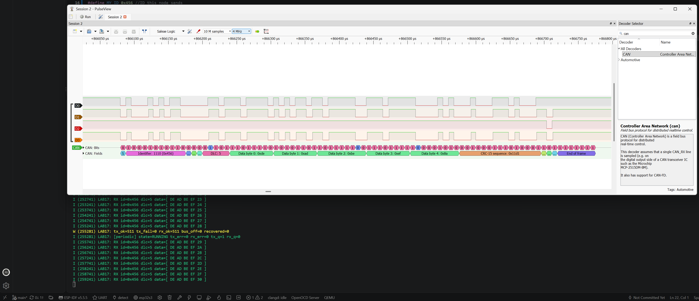
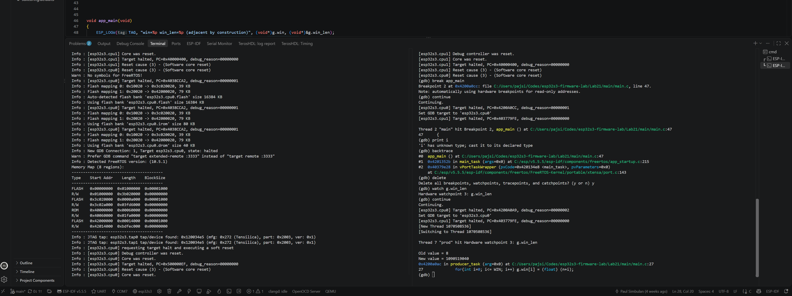
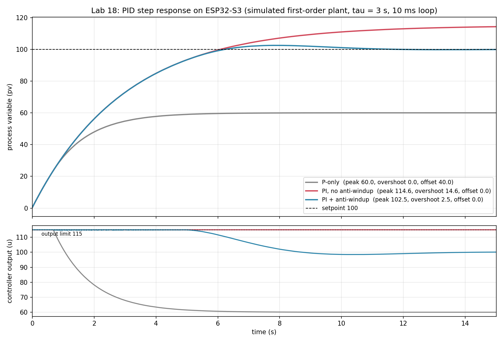
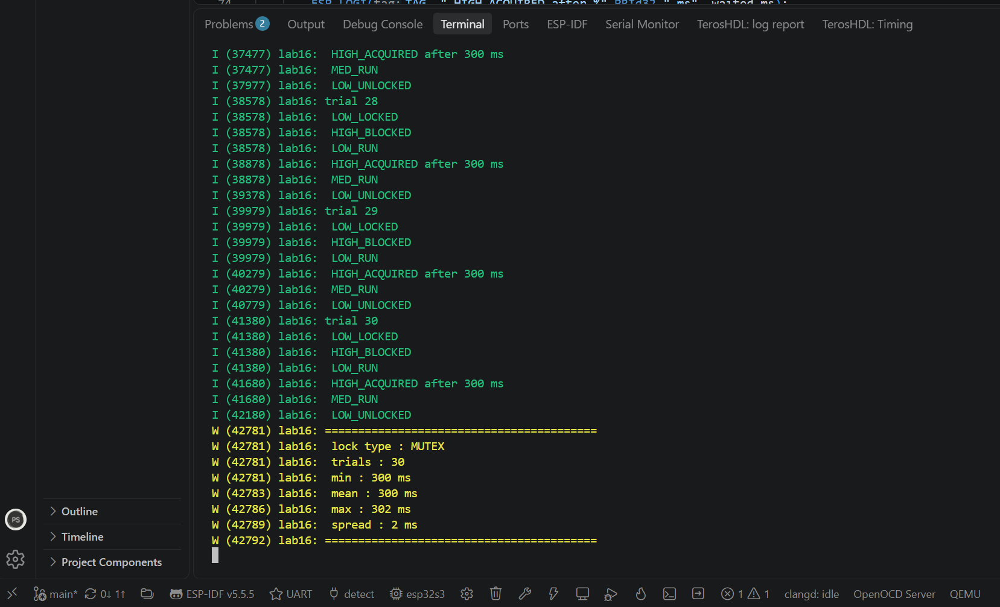

# esp32s3-firmware-lab

Twenty-four firmware labs on the ESP32-S3, written in C with ESP-IDF and FreeRTOS, and every one run on real hardware. GPIO to CAN bus, interrupts to OTA rollback, a logic analyzer on the pins and GDB on the CPU.


| CAN frame decoded between two boards | Watchpoint catching memory corruption |
|---|---|
|  |  |
| **PID step responses from the board** | **Priority inversion, measured** |
|  |  |

## The story

This is one of my two firmware projects. I did this series over the summer to really master the concepts, and then put them to work in my bigger project, Oscil, a two-channel oscilloscope and function generator built on three ESP32-S3s. The labs are the breadth, Oscil is the depth.

At CSUN, ECE 425 taught me embedded systems on the TI TM4C123: bare-metal C, registers, no operating system. I wanted the other half too. I picked the ESP32-S3 because it has everything in one cheap board: two cores, Wi-Fi, BLE, a CAN controller, DMA on almost every peripheral, 8 MB of PSRAM, and a built-in USB JTAG debugger. And ESP-IDF runs on FreeRTOS, so every lab doubled as RTOS practice next to the bare-metal work I was doing at university. The labs use the ESP-IDF drivers, so the focus is on how each peripheral and the RTOS behave. Writing my own register-level drivers came later, in Oscil.

The format is a love letter to classroom labs. Each one has a goal, a build, a measurement and a write-up of what went wrong. A semester usually has 8 to 12 labs. This has 24, and the second half goes well past what a class covers: CAN, OTA with rollback, priority inversion, DMA, hardware watchpoints, and a factory test station.

Every lab README has a **What broke** section, because the bugs are where most of the learning happened.

## Labs

### Foundations

| # | Lab | What it shows |
|---|---|---|
| 0 | [Toolchain and first flash](Lab0) | ESP-IDF project layout, CMake, build, flash and monitor |
| 1 | [GPIO: RGB LED and button](Lab1) | Pin config, pull-ups, active-low input, debounce |
| 2 | [FreeRTOS tasks](Lab2) | Priorities, task states, drift-free `vTaskDelayUntil` |
| 3 | [UART and loopback](Lab3) | 8N1 framing, the UART driver and its RX ring buffer, a loopback self-test |
| 4 | [Hardware timers](Lab4) | Periodic `esp_timer` callback, 500 Hz toggle verified on a logic analyzer |
| 5 | [I2C and an IMU](Lab5) | Address probe, `WHO_AM_I`, burst reads, raw to g |
| 6 | [PWM with LEDC](Lab6) | Duty vs resolution vs frequency, a task-driven LED fade |
| 7 | [Sensor pipeline](Lab7) | Producer and consumer tasks, semaphores, RMS and peak |

### Past the coursework

| # | Lab | What it shows |
|---|---|---|
| 8 | [Interrupts and crash dumps](Lab8) | ISR rules, `IRAM_ATTR`, queue to a task, reading a panic, GDB in the ISR |
| 9 | [SPI master](Lab9) | Full duplex, chip select, SPI modes, loopback decoded `DEADBEEF` |
| 10 | [NVS storage](Lab10) | Key value storage that survives reset, partition tables |
| 11 | [Unit tests on the target](Lab11) | Unity tests running on the chip, logic split from hardware |
| 12 | [Deep sleep](Lab12) | Wake sources, RTC memory, power domains |
| 13 | [Wi-Fi telemetry](Lab13) | Station mode, event handling, JSON HTTP POST to a laptop |
| 14 | [BLE GATT server](Lab14) | NimBLE service, notifications to a phone, the 31-byte advertising limit |
| 15 | [OTA with rollback](Lab15) | A/B slots, self-test, automatic rollback caught on the bench |
| 16 | [Priority inversion](Lab16) | 800 ms with a semaphore, 300 ms with a mutex, 30 trials each |
| 17 | [CAN bus with two nodes](Lab17) | TWAI, arbitration, filters, ACK, error counters, bus-off |
| 18 | [PID control](Lab18) | Anti-windup cuts overshoot from 14.6 to 2.5 |

### Closing the gaps

| # | Lab | What it shows |
|---|---|---|
| 19 | [Labeled data capture for ML](Lab19) | Fixed-rate sampling, feature windows, labeled CSV dataset |
| 20 | [Continuous ADC with DMA](Lab20) | 20 kHz sampling in the background, overflow detection |
| 21 | [JTAG debugging](Lab21) | OpenOCD and GDB, a hardware watchpoint finds an off-by-one |
| 22 | [SPI display with DMA](Lab22) | Ping-pong buffers, 8.0 fps matching the wire limit |
| 23 | [Production test mode](Lab23) | Factory handshake, self-tests, Python station with PASS/FAIL log |

## Skills

- **C for microcontrollers:** `volatile`, ISR-safe code, fixed-size buffers, struct layout, IEEE-754 floats and endianness by hand
- **Buses:** GPIO, UART, I2C, SPI, CAN (TWAI), USB
- **Timing:** `esp_timer`, LEDC PWM, fixed-rate loops, timing checked with a logic analyzer
- **FreeRTOS:** tasks, priorities, core pinning, queues, semaphores, mutexes, priority inheritance, task notifications
- **DMA:** continuous ADC, SPI display with ping-pong buffers
- **Connectivity:** Wi-Fi, HTTP and JSON, BLE GATT with NimBLE, OTA updates with rollback
- **Storage and power:** NVS, partition tables, deep sleep, RTC memory
- **Control and signals:** PID with anti-windup, RMS and peak features
- **Debugging:** OpenOCD, GDB, hardware watchpoints, RTOS-aware backtraces, panic decoding, PulseView protocol decoders
- **Testing:** Unity tests on the target, a factory test station in Python
- **Tools:** ESP-IDF 5.5.5, CMake, `idf.py`, menuconfig, VS Code, clangd, Python, PulseView, 8-channel logic analyzer, nRF Connect

## Bugs worth reading

| Lab | What I saw | What it was |
|---|---|---|
| 5 | `WHO_AM_I` read `0x70`, tutorials say `0x68` | The board has an MPU-6500, not an MPU-6050. Wiring was fine |
| 7 | Windows at 1 Hz instead of 4 Hz | I2C at 100 kHz instead of 400 kHz. Found by toggling a pin and timing the loop |
| 14 | Phone could not find the board | Advertising data was 35 bytes, the limit is 31. Moved the UUID to the scan response |
| 15 | v2 rolled itself back on the bench | The IMU was unplugged, so the self-test failed and rollback did its job |
| 16 | Mutex and semaphore both showed 0 ms | The test used sleeps, so the inversion never happened. Rebuilt with task notifications |
| 17 | Bus-off at 500 kbit/s, clean at 125k | Wiring or termination between transceivers, not the firmware |
| 21 | A loop bound changed by itself | `i <= WIN` wrote one past the array into the next field. Caught with a watchpoint |
| 22 | White screen | Reset wire on the wrong header pin |
| 23 | Station timed out every run | Wrong COM port. The native USB port only carried console output |

## Bench

| | |
|---|---|
| **MCU** | ESP32-S3 N16R8: dual-core Xtensa LX7 at 240 MHz, 16 MB flash, 8 MB PSRAM (two boards for CAN) |
| **Framework** | ESP-IDF 5.5.5 on FreeRTOS |
| **Sensor** | MPU-6500 6-axis IMU over I2C |
| **Other parts** | 2x Adafruit CAN Pal (TJA1051T/3), ST7789V 240x320 SPI TFT, RGB LED, potentiometer |
| **Instruments** | 8-channel logic analyzer with PulseView |
| **Debug** | Built-in USB-JTAG, OpenOCD, GDB |
| **Host** | Windows 11, VS Code, Python |

## Build any lab

```powershell
cd Lab5
idf.py set-target esp32s3
idf.py build
idf.py -p COM3 flash monitor
```

Wi-Fi credentials go in `idf.py menuconfig` and stay in `sdkconfig`, which is not committed.

## Gotchas

- **`sdkconfig.defaults` only applies when there is no `sdkconfig`.** Change a default with an `sdkconfig` present and nothing happens.
- **Flash size defaults to 2 MB.** Set 16 MB before any OTA work.
- **The FreeRTOS tick defaults to 100 Hz.** Then `pdMS_TO_TICKS(1)` is zero. Labs that need 1 ms set it to 1000.
- **The two USB-C ports are different.** One is native USB with JTAG, the other is a USB-UART bridge. Some labs need the second.
- **Do not use GPIO26 to 37 on the N16R8.** They are wired to flash and PSRAM.

MIT licensed.
